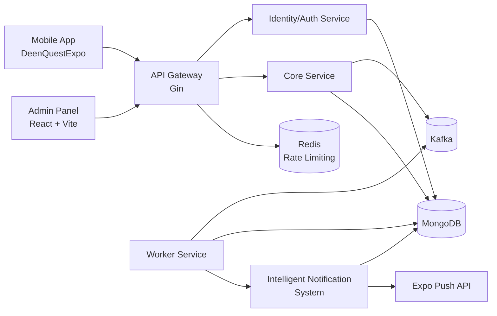

<p align="center">
  
</p>

<h1 align="center">DeenQuest</h1>
<p align="center">
  A gamified Islamic learning platform with a mobile app, admin panel, and scalable Go microservices backend.
</p>

<p align="center">
  
  
  
  
  
  
  
  
  
</p>

---

## App Screenshots

<p align="center">
  
  &nbsp;&nbsp;
  
  &nbsp;&nbsp;
  
  &nbsp;&nbsp;
  
</p>

<p align="center">
  <sub><b>Home</b> — Daily missions, streak &amp; XP progress</sub>
  &nbsp;&nbsp;&nbsp;&nbsp;&nbsp;
  <sub><b>Learning Path</b> — Choose from available courses</sub>
  &nbsp;&nbsp;&nbsp;&nbsp;&nbsp;
  <sub><b>Level Map</b> — Course progression with stars</sub>
  &nbsp;&nbsp;&nbsp;&nbsp;&nbsp;
  <sub><b>Settings</b> — Account, preferences &amp; app info</sub>
</p>

<p align="center">
  
  &nbsp;&nbsp;
  
  &nbsp;&nbsp;
  
  &nbsp;&nbsp;
  
</p>

<p align="center">
  <sub><b>Letter Lesson</b> — Arabic letters with audio</sub>
  &nbsp;&nbsp;&nbsp;&nbsp;&nbsp;
  <sub><b>Dua Lesson</b> — Recitation practice &amp; meaning</sub>
  &nbsp;&nbsp;&nbsp;&nbsp;&nbsp;
  <sub><b>Rewards</b> — Reward vault, milestones &amp; XP bonuses</sub>
  &nbsp;&nbsp;&nbsp;&nbsp;&nbsp;
  <sub><b>Profile</b> — XP, Barakah score &amp; streak history</sub>
</p>

## Why DeenQuest?

DeenQuest is designed to make daily Islamic growth consistent and rewarding through:

- Daily tasks and reflective activities.
- Level progression and XP-based motivation.
- Leaderboard ranking by level and XP.
- Reward-driven engagement loops.
- Admin-controlled content and operations.

## Monorepo Structure

```text
DeenQuest/
├─ DeenQuestExpo/        # Mobile app (React Native + Expo + TypeScript)
├─ admin-panel/          # Web admin dashboard (React + Vite + Tailwind)
└─ backend/              # Go microservices + API gateway + worker
```

## Architecture



## Tech Stack

| Layer | Technologies |
|---|---|
| Mobile | React Native, Expo, TypeScript, Redux Toolkit (RTK Query), AsyncStorage, Expo Notifications |
| Admin | React 18, TypeScript, Vite, Tailwind CSS, Axios, Chart.js |
| Backend | Go 1.22, Gin, JWT, MongoDB driver, Kafka, Redis, Cron |
| Infra | Docker, Docker Compose, Nginx |

## Core Features

- Authentication with JWT and refresh flow.
- Daily tasks with completion tracking.
- Levels, lessons, and progression rewards.
- Leaderboard ranking by level and XP.
- Role-aware admin panel for content management.
- Event-driven processing with Kafka and worker service.
- Intelligent notification system with template-based push notifications:
  - Daily task reminders for pending missions
  - Streak warnings to protect user consistency
  - Friday special reminders for Surah Al-Kahf
  - Leaderboard rank improvement alerts

## API Highlights

Base prefix: `/api/v1`

- Auth
  - `POST /auth/signup`
  - `POST /auth/login`
  - `POST /auth/refresh`
  - `POST /auth/logout`
- User
  - `GET /users/me`
  - `PUT /users/me`
- Core
  - `GET /progress/me`
  - `GET /leaderboard`
  - `GET /daily-tasks`
  - `POST /daily-tasks/:id/complete`
  - `GET /levels?course_type=qaida|tajweed`
  - `GET /levels/:id?course_type=qaida|tajweed`
  - `POST /levels/:id/lessons/complete`
  - `POST /levels/:id/complete`
- Notifications
  - `POST /notifications/token` — Register push notification token

## Quick Start

### 1) Backend (Go + Docker)

```bash
cd backend
cp .env.example .env
make compose-up
```

Services:

- Gateway: `http://localhost:8080`
- Auth: `http://localhost:8081`
- Core: `http://localhost:8082`
- Worker: `http://localhost:8083`

Useful commands:

```bash
make build
make test
make compose-logs
make compose-down
```

### 2) Mobile App (Expo)

```bash
cd DeenQuestExpo
npm install
npm run start
```

Run on device/simulator:

```bash
npm run android
npm run ios
```

Note: Update API base URL in `DeenQuestExpo/app/store/services/api.ts` to match your network and gateway host.

### 3) Admin Panel (Vite)

```bash
cd admin-panel
npm install
npm run dev
```

The admin panel expects API traffic under `/api` and can be routed via your gateway/proxy configuration.

## Environment Notes

Backend environment template is provided in `backend/.env.example`.

Important keys:

- `MONGO_URI`, `MONGO_DB`
- `REDIS_HOST`, `REDIS_PORT`
- `KAFKA_BROKERS`
- `JWT_SECRET`, `JWT_ACCESS_EXPIRY`, `JWT_REFRESH_EXPIRY`
- `AUTH_SERVICE_URL`, `CORE_SERVICE_URL`

## Documentation

Backend docs:

- `backend/docs/api.md`
- `backend/docs/migration.md`
- `backend/docs/kafka-explained.md`
- `backend/docs/daily-task-assignment.md`
- `backend/internal/ai-service/ai-notifications/README.md` — Intelligent notification system
- `backend/internal/ai-service/ai-notifications/WORKFLOW.md` — Notification flow diagrams

## Intelligent Notification System

The worker service runs a cron job every 10 minutes that evaluates all users against 4 notification rules in a single pass:

| Notification Type | Trigger Condition | Cooldown |
|---|---|---|
| Daily Task Reminder | Pending tasks + inactive > 4h | 6 hours |
| Streak Warning | Streak > 3 days + missed today | 12 hours |
| Friday Special | Today is Friday | 24 hours |
| Leaderboard Update | User rank improved | 24 hours |

Key design decisions:
- **Template-based messages** — no AI dependency, instant generation, predictable tone
- **Single-pass processing** — users fetched once, evaluated against all rules
- **Per-type cooldowns** — each notification type tracks its own cooldown window
- **Retry with backoff** — up to 3 attempts with exponential backoff on failure

Full workflow and diagrams: [ai-notifications/README.md](backend/internal/ai-service/ai-notifications/README.md)

## Screens Overview

| Screen | File | Description |
|---|---|---|
| Home | `IMG.PNG` | Daily missions, weekly streak calendar, XP bar |
| Learning Path | `IMG-5.PNG` | Choose from available courses with progress tracking |
| Level Map | `IMG-4.PNG` | Course level progression with star milestones |
| Letter Lesson | `IMG-6.PNG` | Arabic letters with audio pronunciation |
| Dua Lesson | `IMG-7.PNG` | Dua recitation practice with meaning and transliteration |
| Rewards | `IMG-3.PNG` | Reward vault, milestone progress, and unlockable achievements |
| Profile | `IMG-2.PNG` | XP total, Barakah score, streak history |
| Settings | `IMG-8.PNG` | Account settings, preferences, and app info |
| Rank | — | Global leaderboard ranked by level then XP |

## Contributing

1. Create a feature branch.
2. Keep changes scoped to one app/service when possible.
3. Run checks before opening a PR:

```bash
# backend
cd backend && make test

# mobile
cd DeenQuestExpo && ./node_modules/.bin/tsc --noEmit

# admin
cd admin-panel && npm run build
```

## License

No license file is currently defined in this repository.
