<p align="center">
  
</p>

<h1 align="center">DeenQuest</h1>
<p align="center">
  A gamified Islamic learning platform with a mobile app, admin panel, and a clean Go monolithic backend following Domain-Driven Design.
</p>

<p align="center">
  
  
  
  
  
  
  
  
  
  
</p>

---

## App Screenshots

<p align="center">
  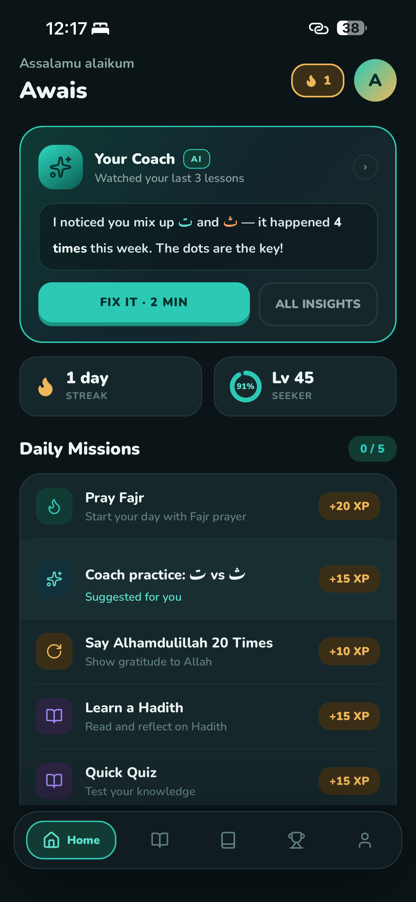
  &nbsp;&nbsp;
  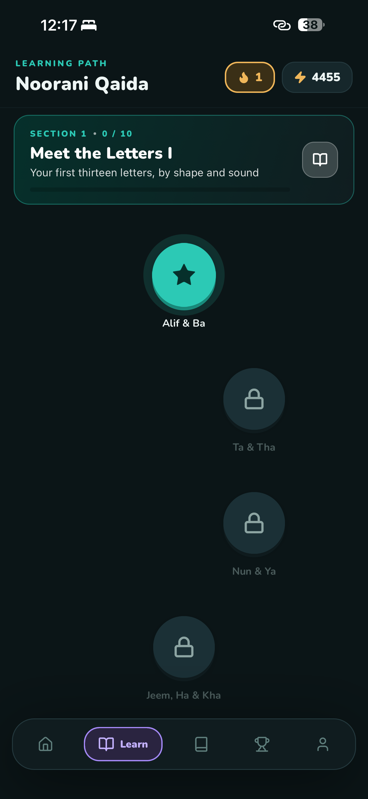
  &nbsp;&nbsp;
  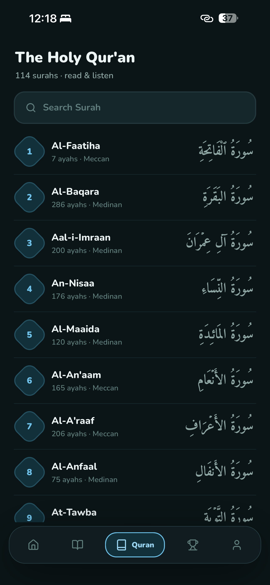
  &nbsp;&nbsp;
  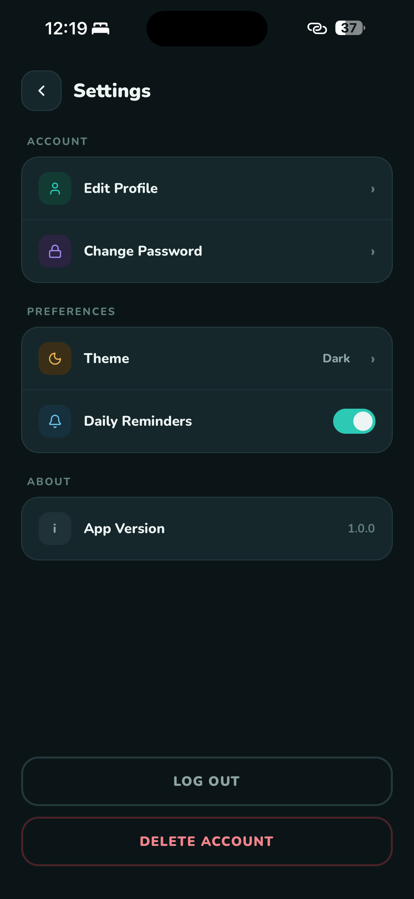
    &nbsp;&nbsp;
  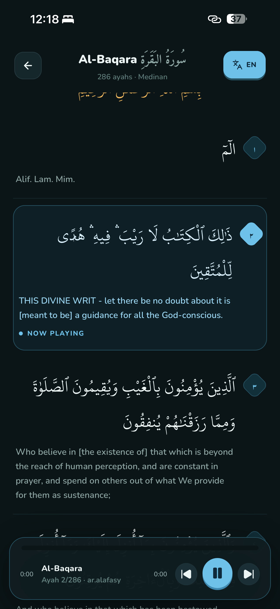
</p>

<p align="center">
  <sub><b>Home</b> — Daily missions, streak &amp; XP progress</sub>
  &nbsp;&nbsp;&nbsp;&nbsp;&nbsp;
  <sub><b>Learning Path</b> — Choose from available courses</sub>
  &nbsp;&nbsp;&nbsp;&nbsp;&nbsp;
  <sub><b>Level Map</b> — Course progression with stars</sub>
  &nbsp;&nbsp;&nbsp;&nbsp;&nbsp;
  <sub><b>Settings</b> — Account, preferences &amp; app info</sub>
</p>

<p align="center">
  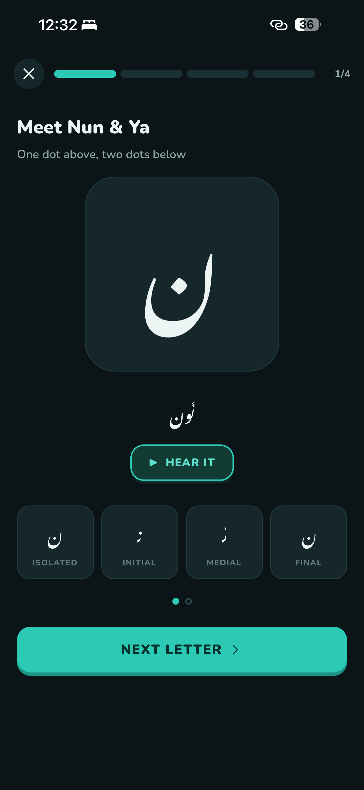
  &nbsp;&nbsp;
  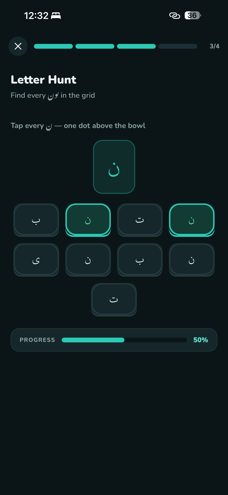
  &nbsp;&nbsp;
  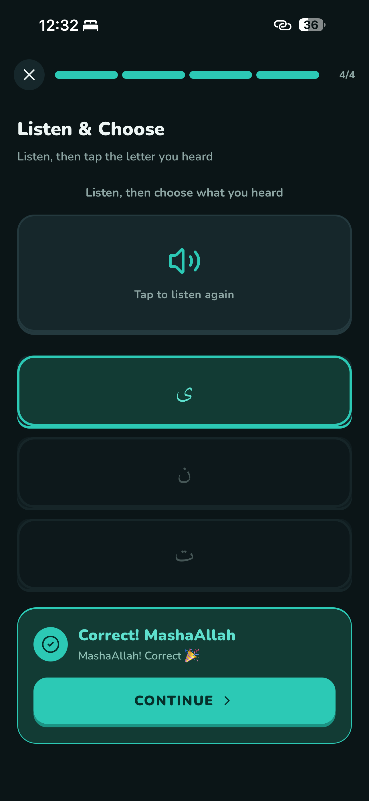
  &nbsp;&nbsp;
  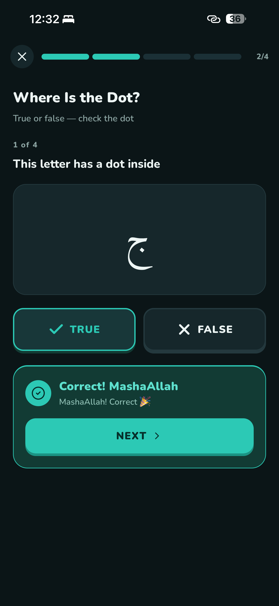
  &nbsp;&nbsp;
  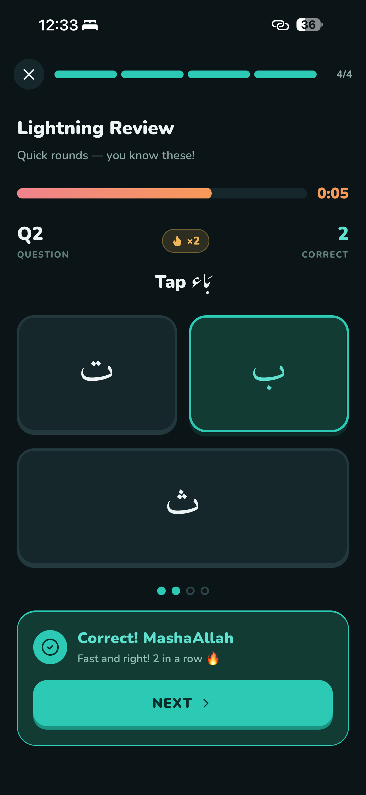
</p>

<p align="center">
  <sub><b>Letter Lesson</b> — Arabic letters with audio</sub>
  &nbsp;&nbsp;&nbsp;&nbsp;&nbsp;
  <sub><b>Dua Lesson</b> — Recitation practice &amp; meaning</sub>
  &nbsp;&nbsp;&nbsp;&nbsp;&nbsp;
  <sub><b>Rewards</b> — Reward vault, milestones &amp; XP bonuses</sub>
  &nbsp;&nbsp;&nbsp;&nbsp;&nbsp;
  <sub><b>Profile</b> — XP, Barakah score &amp; streak history</sub>
</p>

## Why DeenQuest?

DeenQuest is designed to make daily Islamic growth consistent and rewarding through:

- Daily tasks and reflective activities.
- Level progression and XP-based motivation.
- Leaderboard ranking by level and XP.
- Reward-driven engagement loops.
- Admin-controlled content and operations.

## Monorepo Structure

```text
DeenQuest/
├─ DeenQuestExpo/        # Mobile app (React Native + Expo + TypeScript)
├─ admin-panel/          # Web admin dashboard (React + Vite + Tailwind)
└─ backend/              # Go monolithic API (DDD + Clean Architecture)
```

## Backend Architecture

The backend follows **Domain-Driven Design** with **Clean Architecture** principles, organized into four layers:

```text
backend/
├── cmd/
│   └── api/
│       └── main.go                          # Single entry point
├── internal/
│   ├── domain/                              # Domain Layer (entities, value objects, repository interfaces)
│   │   ├── identity/                        #   User entity, UserRepository interface
│   │   ├── progress/                        #   Progress, Streak, DailyTask, Level, Reward, Recitation
│   │   ├── notification/                    #   UserToken, Message, TokenRepository interface
│   │   ├── intelligent/                     #   NotificationRule, NotificationLog, LogRepository interface
│   │   └── learning/                        #   LearnerState, SkillStat, Recommendation, BehaviorEvent
│   ├── application/                         # Application Layer (use cases, application services)
│   │   ├── auth/                            #   AuthService (signup, login)
│   │   ├── user/                            #   UserService (profile, password)
│   │   ├── progress/                        #   CoreService, RecitationService, ArabicMatcher
│   │   ├── notification/                    #   NotificationService (token registration, push)
│   │   ├── intelligent/                     #   Intelligent notification rules, scheduler, user fetcher
│   │   ├── learning/                        #   Learning Agent: publisher, StateUpdater, Recommender, sweep, AI
│   │   └── worker/                          #   Kafka consumer, daily reset scheduler
│   ├── interfaces/                          # Interface Layer (HTTP handlers, DTOs, routing)
│   │   └── http/
│   │       ├── handler/                     #   Auth, User, Core, Recitation, Notification handlers
│   │       ├── dto/                         #   Request/response DTOs
│   │       └── router.go                    #   Unified route registration
│   └── infrastructure/                      # Infrastructure Layer (external concerns)
│       ├── config/                          #   Environment configuration
│       ├── logger/                          #   Structured logging (zap)
│       ├── persistence/                     #   MongoDB repository implementations
│       ├── jwt/                             #   JWT token management
│       ├── bcrypt/                          #   Password hashing
│       ├── cache/                           #   Redis client
│       ├── middleware/                       #   Auth, CORS, logging, rate limiting, recovery
│       ├── push/                            #   Expo push notification client
│       ├── queue/                           #   Kafka producer/consumer
│       ├── validator/                       #   Request validation
│       ├── response/                        #   Standardized API responses
│       ├── ollama/                          #   Ollama LLM client
│       └── gemini/                          #   Gemini client (Learning Agent AI layer)
├── whisper-service/                         # Python speech-to-text microservice (FastAPI)
├── docs/                                    # API docs, workflows, project analysis
├── docker-compose.yml                       # Kafka + Redis infrastructure
├── Makefile                                 # Build, run, test, lint commands
└── go.mod
```

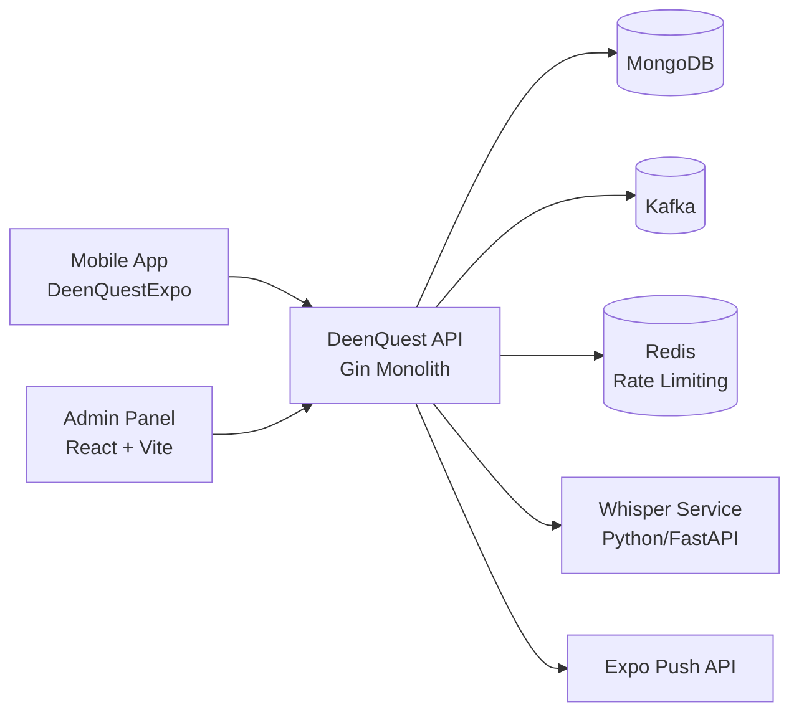

## Tech Stack

| Layer | Technologies |
|---|---|
| Mobile | React Native, Expo, TypeScript, Redux Toolkit (RTK Query), AsyncStorage, Expo Notifications |
| Admin | React 18, TypeScript, Vite, Tailwind CSS, Axios, Chart.js |
| Backend | Go 1.24, Gin, JWT, MongoDB driver, Kafka, Redis, Cron |
| AI (optional) | Google Gemini (Learning Agent feedback/motivation), Whisper (recitation), Ollama client |
| Infra | Docker, Docker Compose |

## Core Features

- Authentication with JWT and refresh flow.
- Daily tasks with completion tracking.
- Levels, lessons, and progression rewards.
- Leaderboard ranking by level and XP.
- Role-aware admin panel for content management.
- Event-driven processing with Kafka.
- **Adaptive Learning Agent** — listens to behavior events, maintains a per-user
  learning state (weak/strong areas, learning speed, engagement, dropout risk),
  and recommends the next best action (revision via spaced repetition or new
  content). Deterministic core with an optional Gemini layer for motivation.
- Intelligent notification system with template-based push notifications:
  - Daily task reminders for pending missions
  - Streak warnings to protect user consistency
  - Friday special reminders for Surah Al-Kahf

## API Highlights

Base prefix: `/api/v1`

- Auth
  - `POST /auth/signup`
  - `POST /auth/login`
- User
  - `GET /users/me`
  - `PUT /users/me`
  - `PUT /users/me/password`
  - `DELETE /users/me`
  - `GET /users/:id/public`
- Progress
  - `GET /progress/me`
  - `GET /progress/user/:id`
  - `GET /leaderboard`
  - `GET /daily-tasks`
  - `POST /daily-tasks/:id/complete`
  - `GET /levels?course_type=qaida|tajweed`
  - `GET /levels/:id?course_type=qaida|tajweed`
  - `POST /levels/:id/lessons/complete`
  - `POST /levels/:id/complete`
  - `GET /rewards`
  - `POST /recitation/check`
- Learning Agent
  - `POST /events` — batched client behavior events
  - `GET /learning/state` — the learner's evolving state
  - `GET /learning/recommendations` — next-best-action set
  - `GET /admin/learning/stats` — aggregate agent metrics (admin)
- Notifications
  - `POST /notifications/register`
  - `POST /notifications/test`

## Quick Start

### 1) Backend (Go + Docker)

```bash
cd backend
cp .env.example .env
# Edit .env with your MongoDB URI and other settings

# Start infrastructure (Kafka + Redis)
make compose-up

# Run the API server
make run
```

The API server starts at `http://localhost:8080`.

Useful commands:

```bash
make build          # Build binary to build/deenquest-api
make run            # Run with go run
make test           # Run tests
make lint           # Format + vet + test
make compose-logs   # Tail infrastructure logs
make compose-down   # Stop Kafka + Redis
```

### 2) Mobile App (Expo)

```bash
cd DeenQuestExpo
npm install
npm run start
```

Run on device/simulator:

```bash
npm run android
npm run ios
```

Note: Update API base URL in `DeenQuestExpo/app/store/services/api.ts` to match your server address.

### 3) Admin Panel (Vite)

```bash
cd admin-panel
npm install
npm run dev
```

The admin panel expects API traffic under `/api`.

## Environment Notes

Backend environment template is provided in `backend/.env.example`.

Important keys:

- `SERVER_HOST`, `SERVER_PORT` — API server bind address
- `MONGO_URI`, `MONGO_DB` — MongoDB connection
- `REDIS_HOST`, `REDIS_PORT` — Redis for rate limiting
- `KAFKA_BROKERS` — Kafka for async event processing
- `JWT_SECRET`, `JWT_ACCESS_EXPIRY`, `JWT_REFRESH_EXPIRY` — JWT configuration
- `WHISPER_URL` — Python whisper service URL
- `EXPO_PUSH_URL`, `EXPO_PUSH_ACCESS_TOKEN` — Push notifications
- `GEMINI_API_KEY`, `GEMINI_MODEL` — optional Learning Agent AI layer (leave the
  key empty to run the agent fully deterministic; defaults to `gemini-2.0-flash`)

## Documentation

Backend docs:

- `backend/docs/api.md` — API endpoint reference
- `backend/docs/kafka-explained.md` — Kafka event architecture
- `backend/docs/daily-task-assignment.md` — Daily task assignment algorithm
- `backend/docs/WORKFLOW.md` — Intelligent notification system workflow
- `backend/docs/PROJECT_ANALYSIS.md` — Comprehensive project analysis
- `backend/docs/learning-agent.md` — Learning Agent: how it works, step by step (plain English)

Project-wide:

- `ROADMAP.md` — Future features, improvements & new agents to build

## Learning Agent

An event-driven engine that personalizes each learner's journey in near real
time. It listens to behavior events, maintains an evolving per-user state, and
decides the next best action — all with a **deterministic, rule-based core** and
an **optional Gemini layer** for motivational copy (the agent works unchanged
with AI disabled).

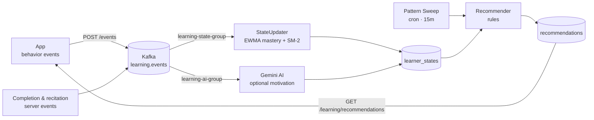

What it detects per user: **weak/strong areas**, **learning speed**,
**engagement**, **dropout risk**, and a **segment** (weak / active / inactive /
improving). What it produces: ranked recommendations — overdue-skill **revisions**
(spaced repetition) first, then **new content**, plus re-engagement for inactive
learners. Admins get a live view (segments, due revisions, an interactive
workflow canvas) on the **Learning Agent** page in the admin panel.

Full walkthrough with examples: `backend/docs/learning-agent.md`.

## Intelligent Notification System

The server runs a cron job every minute that evaluates all users against notification rules in a single pass:

| Notification Type | Trigger Condition | Cooldown |
|---|---|---|
| Daily Task Reminder | Pending tasks + inactive > 4h | 6 hours |
| Streak Warning | Streak > 3 days + missed today | 12 hours |
| Friday Special | Today is Friday | 24 hours |

Key design decisions:
- **Template-based messages** — no AI dependency, instant generation, predictable tone
- **Single-pass processing** — users fetched once, evaluated against all rules
- **Per-type cooldowns** — each notification type tracks its own cooldown window
- **Retry with backoff** — up to 3 attempts with exponential backoff on failure

## Screens Overview

| Screen | File | Description |
|---|---|---|
| Home | `IMG.PNG` | Daily missions, weekly streak calendar, XP bar |
| Learning Path | `IMG-5.PNG` | Choose from available courses with progress tracking |
| Level Map | `IMG-4.PNG` | Course level progression with star milestones |
| Letter Lesson | `IMG-6.PNG` | Arabic letters with audio pronunciation |
| Dua Lesson | `IMG-7.PNG` | Dua recitation practice with meaning and transliteration |
| Rewards | `IMG-3.PNG` | Reward vault, milestone progress, and unlockable achievements |
| Profile | `IMG-2.PNG` | XP total, Barakah score, streak history |
| Settings | `IMG-8.PNG` | Account settings, preferences, and app info |
| Rank | — | Global leaderboard ranked by level then XP |

## Roadmap

We're expanding DeenQuest into a multi-agent learning platform. Planned work
includes a Daily Review screen, streak freeze, offline mode, localization + RTL,
and new agents — an Engagement Agent, a Pronunciation/Tajweed Coach, a Reflection
Companion, a Parent/Teacher Agent, and a (scholar-reviewed) Q&A Knowledge Agent.

See **[ROADMAP.md](ROADMAP.md)** for the full list of features, new agents, and
how each one benefits learners.

## Contributing

1. Create a feature branch.
2. Keep changes scoped to one domain when possible.
3. Run checks before opening a PR:

```bash
# backend
cd backend && make lint

# mobile
cd DeenQuestExpo && ./node_modules/.bin/tsc --noEmit

# admin
cd admin-panel && npm run build
```

## License

No license file is currently defined in this repository.
