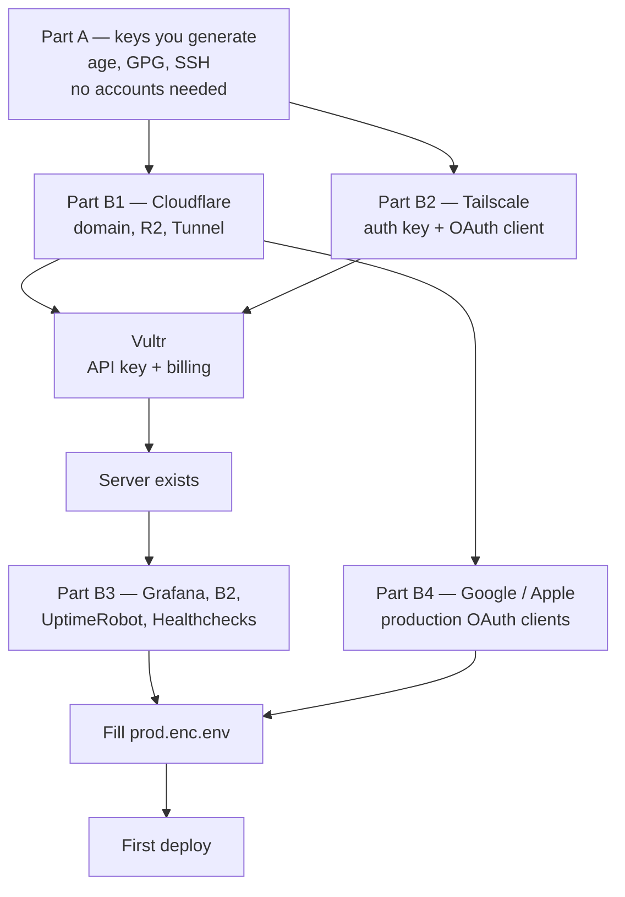

# Account setup — everything you need before the first deploy

This expands Step 1 and Step 2 of [`DEPLOYMENT_GUIDE.md`](DEPLOYMENT_GUIDE.md) into a service-by-service checklist. Work top to bottom: later sections depend on earlier ones.

Dashboard layouts change. Where a click path here doesn't match what you see, the **value you need** is still named correctly — search the dashboard for that.

---

## Rule zero: where secrets go

**Never paste a secret into a chat window, a commit message, an issue, or a plain file in the repo.**

Every secret has exactly one of three homes:

| Home | What lives there | How it gets there |
|---|---|---|
| `deploy/secrets/prod.enc.env` | Everything the server needs at runtime | `sops` encrypts it; the encrypted file is committed |
| GitHub → Settings → Secrets → Actions | The three things CI needs | Pasted into GitHub's UI |
| Your password manager | The break-glass envelope | Manually |

If a value doesn't fit one of those three, it probably shouldn't exist.

---

## Order of work



Parts A, B1 and B2 must come before Vultr, because the server's first boot consumes an SSH key and a Tailscale auth key. Everything else can be done while the server builds.

---

# Part A — Keys you generate yourself

No accounts, no cost. Do these first. Run everything from the repo root.

## A1. age keypair — encrypts the production config and every backup

```bash
brew install age            # macOS; apt install age on Linux
age-keygen -o ~/age-deenquest.key
```

Output looks like:

```
# public key: age1ql3z7hjy54pw3hyww5ayyfg7zqgvc7w3j2elw8zmrj2kg5sfn9aqmcac8p
```

| Piece | Where it goes |
|---|---|
| **Public key** (the `age1…` line) | `.sops.yaml`, replacing `REPLACE_WITH_AGE_PUBLIC_KEY_age1...`, **and** `AGE_PUBLIC_KEY` in the secrets file |
| **Private key** (the file) | Two places only: `/etc/deenquest/age.key` on the server (mode 0400, root), and your password manager |

**The private key never goes into GitHub.** That is what makes "CI never holds a production secret" true: CI ships an encrypted blob it cannot read.

⚠️ **Lose this key and every backup you hold becomes permanently unreadable.** Put it in the password manager *before* you continue.

## A2. Signing key — signs release tags, which is the production deploy gate

Git has verified SSH signatures natively since 2.34, so there is no GPG
toolchain in this path — which also means nothing to install on a Mac where
Homebrew no longer ships bottles.

```bash
git --version                 # must be 2.34 or newer
ssh-keygen -t ed25519 -f ~/.ssh/deenquest_sign -C "release signing" -N ""
```

Configure git to use it:

```bash
git config --global gpg.format ssh
git config --global user.signingkey ~/.ssh/deenquest_sign.pub
git config --global tag.gpgSign true
```

Add the public half to the allowlist the release workflow checks against:

```bash
echo "$(git config user.email) namespaces=\"git\" $(cat ~/.ssh/deenquest_sign.pub)" \
  >> .github/allowed_signers
git add .github/allowed_signers
```

Verify it end to end — this is the gate, so prove it works before you rely on it:

```bash
git config gpg.ssh.allowedSignersFile .github/allowed_signers
git tag -s test-signing -m "test" && git verify-tag test-signing && git tag -d test-signing
```

This key signs tags and **nothing else**. It is deliberately not the key that
reaches the server, so a stolen ops key cannot forge a release, and a stolen
signing key cannot log in anywhere.

## A3. Two SSH keypairs — one for you, one for CI

```bash
ssh-keygen -t ed25519 -f ~/.ssh/deenquest_ops    -C "ops@deenquest"    -N ""
ssh-keygen -t ed25519 -f ~/.ssh/deenquest_deploy -C "github-actions"   -N ""
```

| Key | Public half | Private half |
|---|---|---|
| `deenquest_ops` | `ops_ssh_key` in `prod.tfvars` | Stays on your laptop |
| `deenquest_deploy` | `deploy_ssh_key` in `prod.tfvars` | GitHub secret `DEPLOY_SSH_KEY` |

The deploy key gets a forced command on the server: it can run `deploy.sh` and nothing else — no shell, no file reads, no port forwarding.

## A4. Random secrets — generate now, paste later

```bash
echo "JWT_SECRET=$(openssl rand -base64 48)"
echo "MONGO_ROOT_PASSWORD=$(openssl rand -base64 32)"
echo "MONGO_APP_PASSWORD=$(openssl rand -base64 32)"
echo "MONGO_BACKUP_PASSWORD=$(openssl rand -base64 32)"
echo "REDIS_PASSWORD=$(openssl rand -base64 32)"
echo "WHISPER_INTERNAL_TOKEN=$(openssl rand -hex 32)"
```

Paste straight into the secrets file in Step 9 of the deployment guide. Don't save them anywhere else in between.

`MONGO_APP_PASSWORD` also has to be embedded in `MONGO_URI` — same value, two places.

---

# Part B — Accounts

## B1. Cloudflare — free

**Does four jobs:** DNS and TLS, the Tunnel that removes every inbound port, R2 backup storage, and free hosting for the landing page and admin panel.

**Sign up:** https://dash.cloudflare.com/sign-up

### B1.1 — Add your domain

Add site → enter your domain → Free plan. Cloudflare gives you two nameservers; set them at your registrar (GoDaddy, Namecheap, wherever you bought it). Propagation is usually minutes.

```bash
dig NS deenquest.online +short     # should return two *.ns.cloudflare.com
```

Then under **SSL/TLS**: mode **Full (strict)**, minimum TLS version **1.2**, **Always Use HTTPS** on, **HSTS** on.

### B1.2 — R2 bucket

**R2 → Create bucket** → name `deenquest-backups`, location closest to Mumbai.
Create a second bucket `deenquest-assets` — the Whisper model lives there.

**R2 → Manage API Tokens → Create token**, permission **Object Read & Write**, scoped to those buckets.

Collect: **Access Key ID**, **Secret Access Key**, and your **Account ID** (top right of the R2 page). These configure `rclone` on the server.

> **Be clear-eyed about this:** R2's token scopes are coarse — `Object Read & Write` includes delete. An R2-only setup does *not* stop a compromised server from erasing its own backup history. That is what B2 with Object Lock (B3.2) is for. R2 is the convenient copy; B2 is the one that survives a compromise.

Add a **lifecycle rule** on `deenquest-backups` to expire objects after 180 days, so the free 10 GB doesn't fill up.

### B1.3 — Tunnel

**Zero Trust → Networks → Tunnels → Create a tunnel** → Cloudflared → name `deenquest-prod`.

Cloudflare shows an install command containing a long token. **Copy the token only** — you don't run that command; the compose file runs `cloudflared` for you.

Under **Public hostnames**, add: hostname `api.deenquest.online` → service `http://caddy:80`.

Collect: **tunnel token** → `CF_TUNNEL_TOKEN`.

### B1.4 — Access on the admin panel

**Zero Trust → Access → Applications → Add an application** → Self-hosted → domain `admin.deenquest.online`. Policy: Allow, rule **Emails** = your admin addresses.

This puts an identity check *in front of* your application code — an auth bug in the admin routes still has to get past Cloudflare first.

### B1.5 — Pages (do this after the first deploy)

**Workers & Pages → Create → Pages → Connect to Git.**

| Site | Root directory | Build command | Output | Environment variable |
|---|---|---|---|---|
| Landing | `LandingPage` | `npm run build` | `dist` | — |
| Admin | `admin-panel` | `npm run build` | `dist` | `VITE_API_BASE_URL=https://api.deenquest.online` |

---

## B2. Tailscale — free (100 devices)

**Does one job:** it is the only way into the server. There is no public SSH port.

**Sign up:** https://login.tailscale.com/start — use the same identity provider as GitHub if you can.

Install it on your laptop too, or you will not be able to reach the server.

### B2.1 — Auth key for the server's first boot

**Settings → Keys → Generate auth key**: Reusable **off**, Ephemeral **off**, Pre-approved **on**, expiry 90 days.

Collect: `tskey-auth-…` → `tailscale_auth_key` in `prod.tfvars`. Used once, at first boot.

### B2.2 — OAuth client for CI

**Settings → OAuth clients → Generate OAuth client**, scope **Devices: write**, tag `tag:ci`.

Collect: **Client ID** → GitHub secret `TS_OAUTH_CLIENT_ID`, **Client secret** → `TS_OAUTH_SECRET`.

### B2.3 — ACL: CI reaches SSH and nothing else

**Access Controls**, add:

```jsonc
{
  "tagOwners": { "tag:ci": ["autogroup:admin"] },
  "acls": [
    { "action": "accept", "src": ["autogroup:member"], "dst": ["*:*"] },
    { "action": "accept", "src": ["tag:ci"], "dst": ["deenquest-prod:22"] }
  ]
}
```

Without that second rule scoped tightly, the ephemeral CI node could reach MongoDB and Redis. With it, it can open one TCP port on one host for the ninety seconds it exists.

---

## B3. Storage, monitoring and alerting

### B3.1 — Grafana Cloud (free)

**Sign up:** https://grafana.com/auth/sign-up/create-user → create a stack, region closest to you.

From the stack page, open **Prometheus** → *Sending metrics*, and **Loki** → *Sending logs*:

| Value on screen | Goes to |
|---|---|
| Prometheus remote write endpoint | `GRAFANA_PROM_URL` |
| Prometheus username / instance ID | `GRAFANA_PROM_USER` |
| Loki push URL | `GRAFANA_LOKI_URL` |
| Loki username / User | `GRAFANA_LOKI_USER` |

Then **Security → Access Policies → Create access policy**, scopes `metrics:write` and `logs:write`, and generate a token → `GRAFANA_CLOUD_TOKEN`. One token serves both.

> The allowlist in `deploy/alloy/config.alloy` exists to keep you inside the free series limit. Adding metrics without extending that allowlist thoughtfully is how people blow through it in a day and get throttled mid-incident.

### B3.2 — Backblaze B2 (free 10 GB) — the copy that survives a compromise

**Sign up:** https://www.backblaze.com/sign-up/cloud-storage

**Buckets → Create a Bucket**: name `deenquest-backups-dr`, **Private**, and turn **Object Lock ON**. Object Lock can only be enabled at creation — you cannot add it later.

Set a default retention of 30 days. Locked objects cannot be deleted before that expires, by anyone, with any credential — including someone holding root on your server.

**App Keys → Add a New Application Key**, restricted to that bucket, Read and Write.

Collect: **keyID** and **applicationKey** → `rclone` config on the server.

### B3.3 — UptimeRobot (free, 50 monitors)

**Sign up:** https://uptimerobot.com

**Add New Monitor**: HTTP(s), URL `https://api.deenquest.online/health`, interval 5 minutes, alert contact = your email.

This probes from outside, through Cloudflare, so it validates the whole path — edge, tunnel, Caddy, container — not just that a process is alive.

### B3.4 — Healthchecks.io (free) — the dead-man's switch

**Sign up:** https://healthchecks.io

**Add Check**: name `deenquest-backup`, period **1 hour**, grace **30 minutes**.

Collect: the UUID from the ping URL `https://hc-ping.com/<UUID>` → `HC_UUID`.

> This is the most important alert you will configure. A backup job that silently stops is invisible until the day you need a restore. This one tells you within ninety minutes.

---

## B4. Google and Apple — production OAuth clients

The API refuses to start in production with no OAuth client configured, and sign-in is the only way into the app.

**Use separate clients from development.** A dev client accepting production tokens defeats the environment separation this whole design is built on.

### Google

https://console.cloud.google.com → APIs & Services → Credentials.

| Client type | Notes | Goes to |
|---|---|---|
| Web application | Authorised origins: `https://admin.deenquest.online`, `https://deenquest.online` | `GOOGLE_WEB_CLIENT_ID` |
| iOS | Bundle ID `com.awaisrasool.DeenQuestExpo` | `GOOGLE_IOS_CLIENT_ID` |
| Android | Package name + your **release** SHA-1 | `GOOGLE_ANDROID_CLIENT_ID` |

The Web client ID is required even on Android — it is what mints the ID token. These are not secrets; they ship inside the app binary. The Web client's *secret* is never used and must not go in the file.

### Apple

https://developer.apple.com → Certificates, Identifiers & Profiles. `APPLE_CLIENT_IDS` is the comma-separated list of bundle IDs and service IDs (currently `com.awaisrasool.DeenQuestExpo`).

---

## B5. Vultr — the only paid account

**Sign up:** https://www.vultr.com — add a payment method.

**Account → API → Enable API**, and **add your current IP to the access control list** or the token will be rejected.

Collect the **Personal Access Token**:

```bash
export VULTR_API_KEY=...        # shell only — never committed
```

Before applying Terraform, confirm the plan and OS IDs, because the defaults in `variables.tf` are unverified:

```bash
vultr-cli plans list --region bom | grep -i '4096\|4gb'
vultr-cli os list | grep -i 'ubuntu 24'
```

Set a **billing alert** at roughly $30 so a mistake cannot quietly become expensive.

---

## B6. GitHub

Turn on **2FA** — the deploy path trusts this account.

**Settings → Secrets and variables → Actions**, add exactly three:

| Secret | Value |
|---|---|
| `TS_OAUTH_CLIENT_ID` | From B2.2 |
| `TS_OAUTH_SECRET` | From B2.2 |
| `DEPLOY_SSH_KEY` | Contents of `~/.ssh/deenquest_deploy` (the **private** half) |

`GITHUB_TOKEN` is provided automatically — don't create it.

Note what is *not* here: no database password, no JWT secret, no Cloudflare token. If this account is compromised tomorrow, no production secret leaks — the attacker gains the ability to ask the server to deploy a cosign-verified image, and nothing more.

---

# Part C — Every value and where it lands

## Into `deploy/secrets/prod.enc.env` (encrypted, committed)

| Key | Source |
|---|---|
| `MONGO_URI` | A4 — embed `MONGO_APP_PASSWORD` |
| `MONGO_ROOT_PASSWORD`, `MONGO_APP_PASSWORD`, `MONGO_BACKUP_PASSWORD` | A4 |
| `REDIS_PASSWORD`, `JWT_SECRET`, `WHISPER_INTERNAL_TOKEN` | A4 |
| `ADMIN_EMAILS` | Your email. **Empty = every signed-in user is an admin; the API refuses to start** |
| `CORS_ALLOWED_ORIGINS` | `https://admin.deenquest.online,https://deenquest.online` |
| `TRUSTED_PROXIES` | `172.16.0.0/12` |
| `GOOGLE_*_CLIENT_ID`, `APPLE_CLIENT_IDS` | B4 |
| `CF_TUNNEL_TOKEN` | B1.3 |
| `GRAFANA_PROM_URL`, `GRAFANA_PROM_USER`, `GRAFANA_LOKI_URL`, `GRAFANA_LOKI_USER`, `GRAFANA_CLOUD_TOKEN` | B3.1 |
| `AGE_PUBLIC_KEY` | A1 |
| `HC_UUID` | B3.4 |
| `EXPO_PUSH_ACCESS_TOKEN`, `GEMINI_API_KEY` | Optional — leave empty to run without them |

## Into `deploy/terraform/prod.tfvars` (gitignored)

| Variable | Source |
|---|---|
| `ops_ssh_key` | A3, public half |
| `deploy_ssh_key` | A3, public half |
| `tailscale_auth_key` | B2.1 |
| `region`, `plan`, `os_id` | B5 — verify before applying |

## Into GitHub Actions secrets

`TS_OAUTH_CLIENT_ID`, `TS_OAUTH_SECRET`, `DEPLOY_SSH_KEY`.

## Onto the server directly (never in the repo)

| What | Where |
|---|---|
| age **private** key | `/etc/deenquest/age.key`, mode 0400, root |
| rclone config for R2 and B2 | `rclone config` as the `ops` user |

## Into your password manager — the break-glass envelope

age private key · `MONGO_ROOT_PASSWORD` · MongoDB CA private key (`ca.key`, after `gen-mongo-tls.sh`) · Cloudflare API token · Vultr credentials · Tailscale recovery codes.

---

# Part D — Cost

| Service | Plan | Cost |
|---|---|---|
| Vultr — 2 vCPU / 4 GB, Mumbai | Cloud Compute | **~$24/mo** |
| Domain | registrar | ~$1/mo |
| Cloudflare · Tailscale · Grafana Cloud · R2 · B2 · UptimeRobot · Healthchecks · GitHub · GHCR | Free tiers | **$0** |

Everything except the server and the domain is free, and none of it is architecturally load-bearing — each is replaceable if a free tier changes.

---

# Part E — Final check before you deploy

- [ ] age private key is in the password manager, and you have restored it once to prove it works
- [ ] `git verify-tag` succeeds on a test tag
- [ ] `dig NS <domain>` returns Cloudflare
- [ ] Tailscale shows your laptop
- [ ] `deenquest-backups-dr` on B2 shows **Object Lock: enabled**
- [ ] Three GitHub secrets exist — and nothing else
- [ ] `ADMIN_EMAILS` is not empty
- [ ] `CORS_ALLOWED_ORIGINS` contains no `localhost`
- [ ] Vultr billing alert is set
- [ ] `git status` is clean — no `.tfvars`, no plaintext `prod.env`

Then continue at [`DEPLOYMENT_GUIDE.md`](DEPLOYMENT_GUIDE.md) Step 3.
