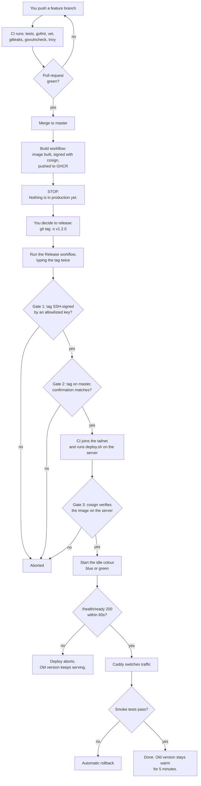

# DeenQuest — Deployment Guide

For a developer who has to deploy this system and has no prior context.

Three documents, three jobs:

| Document | Answers |
|---|---|
| [`VULTR_PRODUCTION_ARCHITECTURE.md`](VULTR_PRODUCTION_ARCHITECTURE.md) | **Why** the infrastructure is shaped this way |
| **This guide** | **How** to set it up and deploy, and **what every file does** |
| [`deploy/README.md`](../deploy/README.md) | Quick command reference once you already know the system |

Read sections 1 and 2 first. They take ten minutes and will save you from the mistakes that matter.

---

## 1. How deployment works

### The mental model

There are **two separate things** that look like one:

1. **Building an image** — happens automatically on every push to `master`. Produces a signed container image in GitHub's registry. **Nothing is deployed.**
2. **Deploying an image** — happens only when a human deliberately triggers it with a signed tag. This is a separate, gated action.

Most mistakes come from assuming a merge to `master` puts code in production. It does not.



### The three gates, in plain terms

| Gate | What it stops |
|---|---|
| **Signed tag + typed confirmation** | An accidental deploy, or someone with repo write access shipping without deliberate intent |
| **Server-side `cosign verify`** | Any image not built by this repository's Build workflow — even if the pipeline itself is compromised |
| **Readiness + smoke tests** | A broken build reaching users. Traffic never moves to a container that failed to start |

### What "blue/green" means here

Two API containers exist: `api-blue` and `api-green`. Only one receives traffic. Deploying means:

1. Start the **idle** one with the new image.
2. Wait for it to report ready.
3. Point Caddy at it.
4. Keep the old one running for 5 minutes, in case you need to go back.

Rollback within those 5 minutes is a single command and takes seconds, because the old container is still running.

### Where things live

| Thing | Where | Why there |
|---|---|---|
| API, MongoDB, Redis, Whisper | One Vultr server, Mumbai | Must be co-located with the data |
| Landing page, admin panel | Cloudflare Pages (free) | Keeps them off the paid server entirely |
| Container images | GitHub Container Registry (free) | — |
| Secrets | Encrypted in this repo, decrypted only on the server | CI never sees a production secret |
| Metrics, logs, alerts | Grafana Cloud (free) | Survives the server being destroyed |
| Backups | Cloudflare R2 + Backblaze B2 (free) | Off Vultr, so a Vultr problem can't touch them |

**The server has zero open inbound ports.** No SSH port, no 80, no 443, no database port. HTTPS arrives through a Cloudflare Tunnel that the server dials *outward*; SSH arrives over Tailscale. This is the single most important property of the design — do not break it.

---

## 2. Every file, and what it does

### Application code (changed for production)

| File | What it does | When you touch it |
|---|---|---|
| `backend/internal/platform/config/config.go` | Loads all configuration. **`validateProduction()` refuses to start on unsafe production config** — empty `ADMIN_EMAILS`, placeholder `JWT_SECRET`, localhost in CORS, MongoDB without credentials, and more | Adding a new environment variable |
| `backend/internal/platform/config/config_test.go` | 17 tests proving each unsafe config is rejected | Adding a new validation rule |
| `backend/internal/app/http.go` | Router. Sets **trusted proxies** (so client IPs can't be forged), and serves `/health` (liveness) and `/health/ready` (readiness — used by the deploy gate) | Adding routes or middleware |
| `backend/internal/app/app.go` | Starts the HTTP server with **timeouts** (Slowloris protection) | Rarely |
| `backend/internal/app/workers.go` | Background workers. Kafka consumer is gated behind `KAFKA_ENABLED` | When a Kafka producer is added |
| `backend/cmd/api/main.go` | Entry point. Logs the build version at startup | Rarely |
| `backend/cmd/healthcheck/main.go` | Tiny probe binary. The production image has **no shell**, so this is what `HEALTHCHECK` and `deploy.sh` call | Rarely |
| `backend/whisper-service/main.py` | Transcription service. Now requires an `X-Internal-Token` header and allows **one transcription at a time** | Changing transcription behaviour |
| `backend/internal/recitation/application/service.go` | Sends the internal token when calling Whisper | Rarely |

### Container build

| File | What it does |
|---|---|
| `backend/Dockerfile` | Two-stage build → **distroless** image (no shell, no package manager). Runs as a non-root user. ~52 MB |
| `backend/.dockerignore` | Keeps `.env`, keys, and the Whisper model out of the build context — **this is a security control, not an optimisation** |
| `backend/whisper-service/Dockerfile` | Whisper image. The 358 MB model is **mounted at runtime, not baked in** |
| `backend/whisper-service/.dockerignore` | Excludes the model and virtualenvs from the build context |

### `deploy/` — the infrastructure

| File | What it does | When you touch it |
|---|---|---|
| `deploy/compose.prod.yml` | **The production stack.** Defines every container, its memory limit, and three networks. The `data` network has `internal: true` — MongoDB, Redis and Whisper have no internet access at all. **No container publishes a port** | Adding a service, changing memory limits |
| `deploy/cloud-init.yaml` | Runs once at first boot: creates users, locks SSH to Tailscale, enables UFW, installs Docker/Tailscale/cosign/sops/rclone, creates swap | Changing host setup (requires a rebuild) |
| `deploy/terraform/main.tf` | Creates the Vultr server, VPC, and the firewall group with an **empty inbound list** | Changing server size or region |
| `deploy/terraform/variables.tf` | Inputs: region, plan, SSH keys, Tailscale key | — |
| `deploy/terraform/example.tfvars` | Template. Copy to `prod.tfvars` (gitignored) and fill in | First-time setup |
| `deploy/caddy/Caddyfile` | Internal reverse proxy config + security headers | Adding headers |
| `deploy/caddy/active.conf` | **The blue/green switch.** One line naming the live container. `deploy.sh` rewrites it | Never by hand |
| `deploy/mongo/init-users.js` | Creates `dq_app` (readWrite on one database) and `dq_backup` (read-only) | Changing database permissions |
| `deploy/alloy/config.alloy` | Ships metrics and logs to Grafana Cloud, with an **allowlist** that keeps you inside the free tier | Adding a metric |
| `deploy/secrets/prod.env.example` | Template for production configuration. **Never contains a real value** | Adding an environment variable |
| `deploy/secrets/prod.enc.env` | The real production config, **encrypted**. Safe to commit | `sops deploy/secrets/prod.enc.env` |
| `.sops.yaml` | Tells SOPS which key encrypts the secrets file | Rotating the age key |

### `deploy/scripts/`

| Script | What it does | Who runs it |
|---|---|---|
| `deploy.sh` | **The only command CI can run on the server.** Verifies the image signature, starts the idle colour, waits for readiness, switches traffic, runs smoke tests, rolls back on failure | CI (or you, for `--rollback`) |
| `smoke.sh` | Post-deploy checks against the public URL: health, **that protected routes still return 401**, security headers | Called by `deploy.sh` |
| `backup.sh` | Hourly encrypted MongoDB dump → R2 and B2, then pings the dead-man's switch | systemd timer |
| `restore.sh` | Restores a backup into a throwaway database and verifies it. **Prints your real RTO** | You, quarterly |
| `gen-mongo-tls.sh` | Creates the private CA and MongoDB certificates | Once, at setup |
| `init-mongo.sh` | Replica set + least-privilege users, and verifies the privilege split. Safe to re-run | Once, at setup |

### `.github/workflows/`

| Workflow | Trigger | What it does |
|---|---|---|
| `ci.yml` | Every push and PR | gofmt, vet, tests against **real MongoDB and Redis**, content lint, gitleaks, govulncheck, trivy, admin panel build |
| `build.yml` | Push to `master` | Builds, signs with cosign, pushes to GHCR. **Deploys nothing** |
| `release.yml` | Manual only | The gated production deploy |

### Client apps

| File | What it does |
|---|---|
| `DeenQuestExpo/app/config/apiConfig.ts` | Reads the API URL from build config instead of a hardcoded address |
| `DeenQuestExpo/app.config.js` | Passes `API_BASE_URL` into the app |
| `DeenQuestExpo/eas.json` | **Per-profile API URLs** — `development` points at your laptop, `production` at the real API |
| `admin-panel/src/lib/api.ts` | Reads `VITE_API_BASE_URL` |

---

## 3. First-time setup

Do this **once**. Budget half a day. Every step ends with a check — do not move on until it passes.

### What you need before starting

- A domain (examples below use `deenquest.online`)
- A payment method for Vultr (~$24/month; everything else is free)
- `terraform`, `docker`, `sops`, `age`, and `vultr-cli` installed locally (no GPG — tags are signed with SSH)

### Step 1 — Free accounts

> **Doing this for the first time?** [`ACCOUNT_SETUP.md`](ACCOUNT_SETUP.md) walks through every account one by one — what to click, which value to copy, and exactly which variable it becomes. This section is the short version.

Sign up for: **Cloudflare** (move your domain's nameservers here), **Tailscale**, **Grafana Cloud**, **UptimeRobot**, **Healthchecks.io**, **Backblaze B2**.

In Cloudflare, create an **R2 bucket** `deenquest-backups` and an API token scoped to it, plus a lifecycle rule to expire old objects. Note that R2's token scopes are coarse — `Object Read & Write` includes delete — so R2 alone does not protect backup history from a compromised server. Create the Backblaze **`deenquest-backups-dr` bucket with Object Lock enabled** for that; Object Lock can only be turned on at bucket creation.

✅ *Check:* `dig NS deenquest.online` returns Cloudflare nameservers.

### Step 2 — Generate keys

```bash
age-keygen -o age.key                 # backup encryption + secrets
ssh-keygen -t ed25519 -f ops_key      # your admin access
ssh-keygen -t ed25519 -f deploy_key   # CI's access
ssh-keygen -t ed25519 -f ~/.ssh/deenquest_sign -N ""   # signs release tags
```

Put the **age private key**, and nothing else, into your password manager along with the passwords you will create later. This is your break-glass envelope.

Export your GPG public key so the release workflow can verify your tags:

```bash
echo "$(git config user.email) namespaces=\"git\" $(cat ~/.ssh/deenquest_sign.pub)" >> .github/allowed_signers
```

✅ *Check:* `age.key` starts with `AGE-SECRET-KEY-`, and `.github/allowed_signers` contains your public key.

### Step 3 — Put the age public key in `.sops.yaml`

```bash
grep 'public key' age.key   # copy the age1... value
$EDITOR .sops.yaml          # replace REPLACE_WITH_AGE_PUBLIC_KEY_age1...
```

### Step 4 — GitHub secrets

In **Settings → Secrets and variables → Actions**, add exactly three:

| Secret | Value |
|---|---|
| `TS_OAUTH_CLIENT_ID` | From Tailscale → Settings → OAuth clients |
| `TS_OAUTH_SECRET` | Same |
| `DEPLOY_SSH_KEY` | Contents of `deploy_key` (the **private** one) |

None of these grants access to production data. That is deliberate.

In Tailscale's ACL editor, restrict the CI tag so it can only reach SSH on the server:

```json
{
  "tagOwners": { "tag:ci": ["autogroup:admin"] },
  "acls": [
    { "action": "accept", "src": ["tag:ci"], "dst": ["deenquest-prod:22"] }
  ]
}
```

### Step 5 — Create the server

```bash
cd deploy/terraform
cp example.tfvars prod.tfvars
$EDITOR prod.tfvars        # paste ops_key.pub, deploy_key.pub, a Tailscale auth key

vultr-cli plans list --region bom     # confirm the plan ID is still current
export VULTR_API_KEY=...
terraform init
terraform plan  -var-file=prod.tfvars
terraform apply -var-file=prod.tfvars
```

✅ *Check — this is the important one:*

```bash
nmap -Pn -p- $(terraform output -raw public_ipv4)
```

**Every port must be filtered.** If anything answers, stop and fix it before continuing. Then confirm you can still get in the intended way:

```bash
tailscale status | grep deenquest-prod
ssh ops@deenquest-prod 'echo reachable over tailscale'
```

### Step 6 — Install the age key on the server

The only secret that must never travel through cloud-init, CI, or the repo:

```bash
scp age.key ops@deenquest-prod:/tmp/age.key
ssh ops@deenquest-prod 'sudo install -m 0400 -o root -g root /tmp/age.key /etc/deenquest/age.key && shred -u /tmp/age.key'
```

### Step 7 — Bootstrap the server

One command does the mechanical half of the remaining setup — repo, scripts,
secret decryption (plus a boot unit so it re-decrypts after a reboot), MongoDB
TLS and users, the Whisper model, and the hourly backup timer:

```bash
ssh ops@deenquest-prod
sudo git clone https://github.com/M-awais-rasool/DeenQuest.git /srv/deenquest
sudo /srv/deenquest/deploy/scripts/bootstrap.sh
```

It is idempotent — re-run it as often as you like. That matters more than the
convenience: it is the half of *rebuild the host* that Terraform does not cover,
and a recovery plan that depends on remembering these steps by hand is not a
plan. It also refuses to continue on the configuration that fails open, so an
empty `ADMIN_EMAILS` or a leftover `REPLACE` stops here rather than in
production.

The script will stop and tell you what to do if a prerequisite is missing. Three
things it deliberately does not do, because each needs a human holding a secret:

| Prerequisite | Where | Covered by |
|---|---|---|
| age private key on the server | Step 6 above | you, once |
| Cloudflare Tunnel + token | Step 8 below | dashboard |
| `prod.enc.env` written and pushed | Step 9 below | your laptop, with `sops` |
| `rclone` remotes `r2:` and `b2:` | run `rclone config` as `ops` | prompted by the script |

Steps 10, 11 and 13 below describe what it does under the hood — read them to
understand the system, but you do not need to run them by hand.

### Step 8 — Cloudflare Tunnel

In the Cloudflare dashboard: **Zero Trust → Networks → Tunnels → Create a tunnel**. Name it `deenquest-prod`. Copy the token — it goes into the secrets file in the next step.

Add a public hostname: `api.deenquest.online` → `HTTP` → `caddy:80`.

### Step 9 — Create the production secrets

```bash
# On your laptop, not the server
cp deploy/secrets/prod.env.example /tmp/prod.env
$EDITOR /tmp/prod.env
```

Generate each secret properly:

```bash
openssl rand -base64 48    # JWT_SECRET
openssl rand -base64 32    # MONGO_ROOT_PASSWORD, MONGO_APP_PASSWORD, MONGO_BACKUP_PASSWORD
openssl rand -base64 32    # REDIS_PASSWORD
openssl rand -hex 32       # WHISPER_INTERNAL_TOKEN
```

Do not skip `ADMIN_EMAILS` — if it is empty, **every signed-in user becomes an admin**, and the API will refuse to start (by design).

Then encrypt, commit, and destroy the plaintext:

```bash
# --filename-override is required: sops matches .sops.yaml's path_regex against
# the INPUT path, and the plaintext deliberately lives outside the repo.
sops -e --filename-override deploy/secrets/prod.enc.env /tmp/prod.env > deploy/secrets/prod.enc.env
shred -u /tmp/prod.env
git add deploy/secrets/prod.enc.env
git commit -m "chore: production secrets"
git push
```

✅ *Check:* `cat deploy/secrets/prod.enc.env` shows ciphertext, and `sops -d deploy/secrets/prod.enc.env` shows the real values.

### Step 10 — MongoDB

> Run by `bootstrap.sh`. Documented here so you know what it did.

```bash
ssh ops@deenquest-prod
cd /srv/deenquest/deploy

# 1. Private CA and server certificate
sudo ./scripts/gen-mongo-tls.sh

# 2. Decrypt the config to tmpfs so compose can read it
sudo install -d -m 0700 /run/deenquest
sudo SOPS_AGE_KEY_FILE=/etc/deenquest/age.key sops -d secrets/prod.enc.env \
  | sudo tee /run/deenquest/prod.env >/dev/null
sudo chmod 0400 /run/deenquest/prod.env

# 3. Replica set + least-privilege users, in one step
sudo ./scripts/init-mongo.sh
```

`init-mongo.sh` is a script rather than a list of commands because the sequence is easy to get subtly wrong — with `--auth` the localhost exception disappears as soon as the root user is created, and `requireTLS` means every `mongosh` call needs `--tls` and the CA path. The script is safe to re-run; it skips anything already done.

It finishes by proving the privilege split actually holds — `dq_app` should be unable to read the `admin` database.

Then move the CA private key into your password manager and remove it from the server:

```bash
sudo shred -u /srv/deenquest/deploy/mongo/tls/ca.key
```

✅ *Check:* the script prints `ok: dq_app cannot read the admin database`.

### Step 11 — Whisper model

> Run by `bootstrap.sh`, provided the model is already in R2.

The model is not in the image. Upload it once, then copy it onto the volume:

```bash
# From your laptop
rclone copy backend/whisper-service/models/quran-base-ct2 r2:deenquest-assets/quran-base-ct2

# On the server
sudo rclone copy r2:deenquest-assets/quran-base-ct2 \
  /var/lib/docker/volumes/deploy_whisper_models/_data/quran-base-ct2
```

### Step 12 — First deploy

```bash
git tag -s v0.1.0 -m "first production release"
git push --tags
```

Then in GitHub → **Actions → Release → Run workflow**, enter `v0.1.0` in **both** fields.

✅ *Check:*

```bash
curl https://api.deenquest.online/health
curl -o /dev/null -w '%{http_code}\n' https://api.deenquest.online/api/v1/users/me   # must be 401
```

### Step 13 — Backups and monitoring

> The backup timer is installed by `bootstrap.sh`. The monitoring accounts below are still yours to wire up.

On the server, create the backup timer:

```bash
sudo tee /etc/systemd/system/deenquest-backup.service <<'EOF'
[Service]
Type=oneshot
EnvironmentFile=/run/deenquest/prod.env
ExecStart=/usr/local/bin/backup.sh
EOF

sudo tee /etc/systemd/system/deenquest-backup.timer <<'EOF'
[Timer]
OnCalendar=hourly
Persistent=true
[Install]
WantedBy=timers.target
EOF

sudo systemctl daemon-reload && sudo systemctl enable --now deenquest-backup.timer
sudo systemctl start deenquest-backup   # run one now
```

✅ *Check:* the file appears in R2, **and** Healthchecks.io shows a green ping.

Add an UptimeRobot monitor for `https://api.deenquest.online/health`, 5-minute interval.

### Step 14 — Front ends

Deploy the landing page and admin panel to Cloudflare Pages. For the admin panel set the build variable `VITE_API_BASE_URL=https://api.deenquest.online`, and put **Cloudflare Access** in front of `admin.deenquest.online` so there is an identity check before your application code is even reached.

Make sure `https://admin.deenquest.online` is listed in `CORS_ALLOWED_ORIGINS` in the secrets file.

### Final checklist

- [ ] `nmap -Pn -p- <ip>` shows **no open ports**
- [ ] `https://api.deenquest.online/health` returns 200
- [ ] `/api/v1/users/me` without a token returns **401**
- [ ] Admin panel asks for SSO before loading
- [ ] Grafana Cloud is receiving metrics and logs
- [ ] A backup landed in R2 **and** B2, and Healthchecks is green
- [ ] `restore.sh` has been run once successfully
- [ ] The break-glass envelope contains: age private key, all database passwords, MongoDB CA key, Cloudflare and Tailscale tokens
- [ ] No production secret exists on any developer laptop

---

## 4. Deploying a change

This is the whole day-to-day loop.

```bash
# 1. Work on a branch
git checkout -b feat/my-change
# ... make changes ...
git push -u origin feat/my-change
```

Open a pull request. CI runs automatically — tests against real MongoDB and Redis, secret scanning, vulnerability scanning. **Merge only when green.**

```bash
# 2. Merge to master. The Build workflow publishes a signed image.
#    Nothing is deployed yet.

# 3. When you want it live, tag it
git checkout master && git pull
git tag -s v1.2.0 -m "add streak reminders"
git push --tags
```

```
# 4. GitHub → Actions → Release → Run workflow
#    tag:     v1.2.0
#    confirm: v1.2.0     (must match exactly)
```

Watch the workflow. It takes 2–3 minutes. Then confirm:

```bash
curl https://api.deenquest.online/health/ready
```

And watch Grafana for five minutes. Most bad deploys announce themselves inside two.

### If something is wrong

**Within 5 minutes** — the old container is still running, so this is instant:

```bash
ssh ops@deenquest-prod deploy.sh --rollback
```

**After 5 minutes** — run the Release workflow again with the previous tag. Takes about a minute.

---

## 5. Common tasks

### Add or change an environment variable

```bash
sops deploy/secrets/prod.enc.env      # opens decrypted, re-encrypts on save
git commit -am "chore: add FEATURE_X_ENABLED"
git push
```

Then deploy — configuration only takes effect on the next release. If the variable is also read by `compose.prod.yml` (infrastructure rather than application config), add it to `deploy/secrets/prod.env.example` too so the next person knows it exists.

### Rotate a secret

Same as above, then revoke the old value at its source (Google Cloud, Cloudflare, Tailscale). Check Grafana logs afterwards for any use of the old credential after the rotation timestamp.

Rotating `JWT_SECRET` does **not** log users out. Access tokens become invalid for up to 15 minutes, but refresh tokens are stored hashed in MongoDB and validated by lookup, so sessions survive.

### Read logs

Grafana Cloud is the primary place, and it keeps working when the server does not. On the box directly:

```bash
ssh ops@deenquest-prod
cd /srv/deenquest/deploy
docker compose -f compose.prod.yml logs -f api-blue
cat /var/lib/deenquest/colour     # which colour is live
```

### Restore a backup

```bash
# Test restore — safe, uses a throwaway database
AGE_KEY_FILE=~/age.key ./deploy/scripts/restore.sh \
  r2:deenquest-backups/hourly/deenquest-20260826T090000Z.archive.gz.age

# Real restore — destroys current production data, asks for confirmation
AGE_KEY_FILE=~/age.key ./deploy/scripts/restore.sh <path> --into-production
```

**Do the test restore once a quarter.** The script prints how long it took; that number is your actual recovery time, and it should replace the estimate in the architecture document.

### Change server size

```bash
$EDITOR deploy/terraform/prod.tfvars     # change `plan`
terraform apply -var-file=prod.tfvars    # causes a reboot
```

### Add a new service to the stack

Edit `deploy/compose.prod.yml`. Two rules: **give it a memory limit** (4 GB total, and the current budget already uses ~3.5 GB at deploy peak), and **put it on the `data` network if it does not need internet access**.

---

## 6. Troubleshooting

| Symptom | Likely cause | Fix |
|---|---|---|
| Deploy fails at "waiting for ready" | Bad config, or MongoDB unreachable | `docker compose logs api-green`. The config validator lists every problem by name |
| API logs "refusing to start with an unsafe production config" | A required variable is missing | Read the list — it names each one. Fix with `sops`, redeploy |
| Release workflow: "Tag is not signed" | Tag made without `-s`, or your key is not in `.github/allowed_signers` | `git tag -d v1.2.0 && git tag -s v1.2.0 -m "..."` |
| Release workflow: "No published image" | Build workflow did not run or failed on that commit | Check Actions for that commit; re-run Build |
| Deploy fails at signature verification | The image was not built by the Build workflow | Never bypass this. Find out why the digest is unexpected |
| Smoke test fails on 401 check | Authentication is not being enforced — **serious** | Automatic rollback already happened. Investigate before redeploying |
| `502` from Cloudflare | Tunnel is down, or Caddy points at a stopped container | `docker compose ps`, `docker compose logs cloudflared` |
| Whisper returns 401 | `WHISPER_INTERNAL_TOKEN` differs between API and Whisper | They read the same variable — redeploy both |
| Whisper very slow | One transcription at a time, by design | Expected under load. Moving Whisper to its own node is the fix (+$12–18/mo) |
| Rate limiting stopped working | Redis is down — it fails open | Check `redis_up` in Grafana; restart Redis |
| Alerts stopped arriving | Grafana Cloud free-tier series limit | Tighten the allowlist in `deploy/alloy/config.alloy` |
| Disk full | Docker images and logs accumulating | `docker system prune -af`. The weekly cron should prevent this |
| Can't SSH | Tailscale down on your machine or the server | `tailscale status`. There is no fallback SSH port — that is deliberate |

### Emergency: the server is gone

1. `cd deploy/terraform && terraform apply -var-file=prod.tfvars`
2. Repeat setup steps 6, 7, 10, 11
3. Restore the newest backup with `restore.sh ... --into-production`
4. Point the Cloudflare Tunnel at the new server
5. Run the Release workflow with the last known-good tag

Realistically 2–4 hours. That is the accepted cost of a single-node design — see §16 of the architecture document for the $6/month change that reduces it to about 15 minutes.

---

## 7. Rules you must not break

Each of these silently destroys a property the design depends on.

**Never add `ports:` to a container in `compose.prod.yml`.** Docker writes its own iptables rules and bypasses UFW entirely. One published port undoes the zero-inbound-ports design.

**Never add an inbound rule to the Vultr firewall group.** The accept-list stays empty. Ingress is the tunnel; admin access is Tailscale.

**Never mount the Docker socket** into a container that has internet access. A read-only bind still grants full Docker API access, which is effectively host root.

**Never edit files directly on the server.** It is a bug in the repo until it is committed, and the next deploy silently erases the fix. If you had to change something on the box, that change belongs in a pull request.

**Never make a destructive change to startup seeding or indexes in one release.** Blue and green briefly run against the same database. Additive changes only; destructive ones go through expand/contract across two or three releases.

**Never put a real secret in `prod.env.example`, `.env.example`, or any tracked file.** `gitleaks` blocks most of this, but it is not infallible.

**Never point a development build at the production API,** and never point production at development. That is what the EAS build profiles are for.

**Never skip the quarterly restore drill.** An untested backup is a hypothesis. The failure mode is discovering it during an incident.
