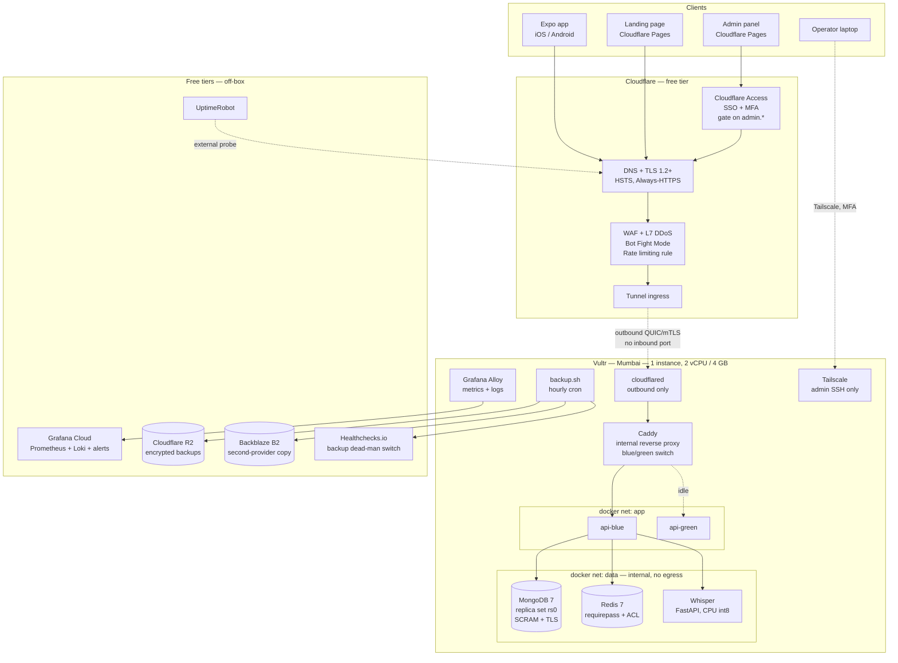
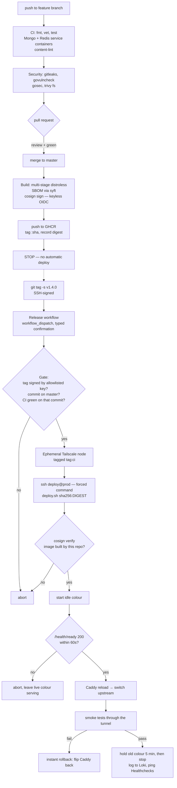

# DeenQuest — Vultr Production Architecture

**Target:** production on Vultr at **$24/month**, hard-isolated from local development.
**Region:** Mumbai (`blr`/`bom`) — closest to a South Asia user base.
**Accounts:** one Vultr account, production only. Development stays on the laptop.
**CI/CD:** GitHub Actions on a Free plan, private repo.

Every price below is approximate — confirm against Vultr's current pricing page before you provision. Every free tier named is a real free tier today, but free tiers move; the design degrades gracefully if one changes.

---

## 1. What the code forces

This design is not generic. It was derived by reading the repository, and these findings are what shaped it.

| # | Finding | Where | Consequence |
|---|---|---|---|
| 1 | Data stores are **MongoDB + Redis**, not Postgres | `backend/go.mod`, `backend/internal/app/infra.go` | Vultr Managed Databases don't cover MongoDB → self-host it |
| 2 | **Kafka has one consumer and zero producers** | `backend/internal/app/workers.go:23` is the only consumer; nothing calls `Publish` | Don't run a broker in production. Saves ~1 GB RAM — a quarter of the box |
| 3 | Whisper is a **358 MB CTranslate2 model** behind FastAPI with **no authentication** | `backend/whisper-service/main.py` | Must never be reachable from outside; CPU-bound, needs hard limits |
| 4 | **`ADMIN_EMAILS` empty means every signed-in user is an admin** | `backend/internal/platform/config/config.go`, `AdminEmailList()` | A missing env var in prod is a total authorization bypass → must fail at boot |
| 5 | **`JWT_SECRET` defaults to `change-me-in-production`** and is accepted silently | `backend/internal/platform/config/config.go` | Same class of failure → must fail at boot |
| 6 | **No `SetTrustedProxies`** anywhere | grep across `backend/` | Behind a proxy, Gin trusts client-supplied `X-Forwarded-For`, so `c.ClientIP()` is attacker-controlled |
| 7 | Rate limiter is **one global 100/min bucket keyed on `ClientIP`, and fails open** | `backend/internal/platform/middleware/rate_limit.go` | Combined with #6, trivially bypassed by rotating a header. Auth endpoints have no dedicated limit |
| 8 | **`http.Server` has no timeouts** | `backend/internal/app/app.go`, `&http.Server{Addr, Handler}` | Slowloris and slow-body resource exhaustion |
| 9 | **No `/metrics`**, and `/health` doesn't touch Mongo or Redis | `backend/internal/app/http.go:44` | Nothing to monitor, and no usable readiness gate for deploys |
| 10 | Startup **seeds and creates indexes on every boot** | `backend/internal/app/seed.go`, `Indexes().CreateMany` in every repo | Every deploy writes to production data → forces expand/contract discipline |
| 11 | Redis is optional (`infra.Redis` nil-checked) | `backend/internal/app/infra.go` | A Redis outage **silently disables rate limiting** rather than failing loudly |
| 12 | An unused **Firebase service-account private key** sits at the repo root | `deenquest-850e0-firebase-adminsdk-*.json`, referenced nowhere in Go | Delete it and revoke the key |
| 13 | Expo app **hardcodes `http://192.168.18.12:8080`** | `DeenQuestExpo/app/store/services/api.ts:17` | A production build could ship pointing at a laptop, or a dev build at prod |
| 14 | Admin panel calls a relative `/api` | `admin-panel/src/lib/api.ts:11` | Needs an env-driven base URL if hosted off-origin |
| 15 | Refresh tokens are **hashed, family-scoped, reuse-detecting, TTL-indexed** | `backend/internal/auth/infrastructure/mongo_refresh_repository.go` | Already correct. Don't redesign it — build around it |
| 16 | No Dockerfile, no CI, no deployment of any kind exists | repo | Everything below is greenfield |

Findings 4–8 and 12 are the ones I'd fix before the first production deploy regardless of what infrastructure you choose. They're collected with concrete fixes in [§11](#11-code-changes-this-design-requires).

---

## 2. The $24 decision, stated honestly

$24/month buys **one server**. Everything else in this design has to be free, or it doesn't exist.

So the central strategy is: **put nothing on the paid box that a free tier can hold.** Static hosting, the edge, TLS, DDoS protection, the WAF, metrics storage, log storage, alerting, uptime checks, the container registry, backup storage, and the VPN all move off the server to free tiers. The server runs only what genuinely must be co-located with the data: the API, MongoDB, Redis, and Whisper.

**What you get**

- Production is architecturally isolated from development — not by policy, but because prod's databases have no listener reachable from anywhere a laptop can get to.
- **Zero inbound ports.** No SSH port, no 80, no 443, no database port. The box's public interface denies everything. All traffic arrives through outbound-initiated tunnels.
- A CI/CD pipeline where **CI never holds a production secret** and **the box only runs container images cryptographically proven to come from your repo**.
- Hourly encrypted off-site backups to two providers outside Vultr, which a compromised production box cannot delete or decrypt.
- Metrics, logs, alerting, uptime monitoring, and a backup dead-man's switch — all free.

**What you do not get, and should not pretend you do**

| Gap | Reality | What buys it |
|---|---|---|
| High availability | One node. If it dies, you're down until you rebuild. | +$6–24/mo (§16) |
| Fast recovery from host loss | Rebuild + restore is realistically **2–4 hours** | A warm standby node |
| Full-disk encryption at rest | MongoDB Community has no native encryption at rest, and disk encryption on a cloud VM needs a key at boot that has to live somewhere. See [§10](#10-encryption-what-is-real-and-what-is-not). | Block Storage + LUKS + a key custody decision |
| Multi-person deploy approval | GitHub Free private repos don't have Environment protection rules | GitHub Team, or the substitute gate in [§12](#12-cicd-pipeline) |
| Room to grow without thinking | 4 GB RAM is the binding constraint, and the memory budget in [§7](#7-container-topology-and-the-memory-budget) is tight | The scale path in [§16](#16-scale-path) |

That table is the deliverable as much as the architecture is. A design that claims HA on one node is worse than no design.

---

## 3. Target architecture



**The single most important line in that diagram is the dotted one from Tunnel to `cloudflared`.** It points *outward* from the box. There is no arrow pointing in. Cloudflare cannot connect to your server; your server connects to Cloudflare and keeps the connection open. The same is true for Tailscale. That is why the Vultr firewall can deny 100% of inbound traffic and the design still works — and why there is no origin IP worth discovering, no port to scan, and no SSH daemon exposed to the internet.

---

## 4. Resource inventory and cost

### Paid — Vultr

| Resource | Spec | Purpose | ~$/mo |
|---|---|---|---|
| Cloud Compute (High Frequency or Regular) | 2 vCPU / 4 GB / ~80–128 GB NVMe, Mumbai | The entire production stack | **~$24** |
| VPC 2.0 | free | Private interface, in place before you need a second node | $0 |
| Firewall Group | free | Deny-all inbound, both address families | $0 |
| **Total** | | | **~$24** |

Provision the VPC and firewall group even though there's one node. Attaching them later means a reboot and an IP change; attaching them now costs nothing.

Skip **Vultr Object Storage (~$5/mo)** — Cloudflare R2's free 10 GB with zero egress fees covers backups for a long time at this data size, and keeping backups off Vultr is strictly better for disaster recovery anyway. Skip **Vultr Automatic Backups (+20%, ~$4.80/mo)** for now too; the logical dumps in [§14](#14-backups-and-disaster-recovery) are portable to any provider, whereas a Vultr snapshot only restores onto Vultr. Revisit both when the budget grows.

### Free — everything else

| Service | Free tier used | Role | Watch out for |
|---|---|---|---|
| Cloudflare DNS + Proxy | Free plan | Authoritative DNS, TLS termination, L7 DDoS, managed WAF rules, Bot Fight Mode | Free plan allows roughly one custom rate-limiting rule |
| Cloudflare Tunnel | Free | Ingress with zero open ports | — |
| Cloudflare Access | Free for a small number of users | SSO + MFA gate in front of `admin.deenquest.app` | Seat cap on the free Zero Trust plan |
| Cloudflare Pages | Free | Hosts the landing page and admin panel — keeps both entirely off the paid box | Build minutes cap |
| Cloudflare R2 | 10 GB storage, no egress fees | Primary backup target | 10 GB ceiling — the GFS policy in §14 stays well inside it |
| Backblaze B2 | 10 GB | Second-provider backup copy | — |
| Tailscale | Personal plan, ~100 devices | Operator SSH, and the CI deploy path | — |
| GitHub Actions | ~2,000 min/mo, private repo | CI and deploys | The pipeline in §12 is built to stay inside this |
| GHCR | Included with Actions | Registry for the Go image (~25 MB) | Private package storage is small — keep the Whisper image off it (§12) |
| Grafana Cloud | Free: metrics series, log volume, and alerting | Metrics, logs, dashboards, alert routing | Cardinality. Use the allowlists in §13 or you'll blow the series cap in a day |
| UptimeRobot | 50 monitors, 5-min interval | External uptime probe | — |
| Healthchecks.io | Free | Backup dead-man's switch | — |
| Sentry (optional) | Free error quota | Error tracking | Requires a code change |

**Running total: ~$24/month.**

---

## 5. Environment separation

You chose local-only development with production exclusively on Vultr. That's the right call at this budget — but it removes the pre-production environment that normally catches configuration mistakes, so the separation has to be enforced structurally rather than by discipline.

### The contract

| Dimension | Local development | Production |
|---|---|---|
| Runs on | Developer laptop, `make compose-up` | One Vultr instance, Mumbai |
| `APP_ENV` | `development` | `production` — enables Gin release mode and the fail-fast checks in §11 |
| MongoDB | `mongo:7` container, no auth, published on `localhost:27017` | Single-node replica set `rs0`, SCRAM-SHA-256 + TLS, port never published |
| Reachable from a laptop? | Yes | **No.** No inbound rule, no published port, no public listener — not even over Tailscale unless deliberately port-forwarded for a break-glass session |
| Redis | Container, no password | `requirepass` + ACL user, internal Docker network only |
| Kafka | `docker-compose.yml` (ZooKeeper + Confluent) | **Not deployed** — see §8 |
| Whisper | `make whisper-run` on `localhost:8001` | Container on an internal network, plus a shared-secret header |
| Secrets | `.env` copied from `.env.example`, dummy values | `prod.enc.env`, SOPS/age-encrypted in git, decrypted to tmpfs at boot |
| `JWT_SECRET` | Any dev value | 48 random bytes, unique to prod, rotated quarterly |
| Google / Apple OAuth | A **separate** dev OAuth client | A **separate** prod OAuth client |
| `ADMIN_EMAILS` | Your address | Explicit allowlist; **boot fails if empty** |
| `CORS_ALLOWED_ORIGINS` | `localhost:*` | Exact production origins; boot fails if it contains `localhost` |
| Expo client | `development` EAS profile → local API | `production` EAS profile → `https://api.deenquest.app` |
| Data | Disposable, seeded, fake users | Real users |
| How code reaches it | Not applicable | Signed tag → CI → forced-command SSH → verified image |

### The five rules that make it structural

1. **No production credential ever exists on a developer machine.** Break-glass credentials live in a password manager, not a file, not a note, not `~/.env.prod`.
2. **Production MongoDB and Redis have no network path from the internet.** Not "firewalled off" — there is no published port and no listener on a routable interface. A developer cannot point their laptop at production data even by accident, because there is nothing to point at.
3. **The only process that writes to production is `deploy.sh`,** invoked through a forced-command SSH key, running a container image whose signature has been verified.
4. **Everything that reaches production is in git** (configuration), **encrypted in git** (secrets), or **in GHCR** (images). Nothing is hand-edited on the box. If you SSH in to fix something, that fix is a bug in the repo until it's committed.
5. **`gitleaks` runs on every pull request and blocks the merge.** `.env*` is already gitignored except `.env.example`, and git history is clean — verified: no `.env`, key, or credential file has ever been committed.

Rule 2 is what converts "production data must never be affected by development" from a promise into a property of the network.

### The two leaks this arrangement still has

**The mobile app's base URL.** `DeenQuestExpo/app/store/services/api.ts:17` hardcodes a LAN address. Whichever value is in the file at build time ships to real devices. Fix it before the first production build:

```js
// app.config.js
export default ({ config }) => ({
  ...config,
  extra: {
    apiBaseUrl: process.env.API_BASE_URL ?? 'http://192.168.18.12:8080',
    eas: { projectId: '...' },
  },
});
```

```jsonc
// eas.json
{
  "build": {
    "development": { "env": { "API_BASE_URL": "http://192.168.18.12:8080" } },
    "preview":     { "env": { "API_BASE_URL": "https://api.deenquest.app" } },
    "production":  { "env": { "API_BASE_URL": "https://api.deenquest.app" } }
  }
}
```

Then read it via `Constants.expoConfig.extra.apiBaseUrl`.

**Startup seeding.** `backend/internal/app/seed.go` runs on every container start, so every deploy writes to production data. There's a silver lining — a failing seed aborts the deploy rather than corrupting a live service, because the blue/green health gate never switches traffic to a container that failed to start. But it means **every seed and index change must be additive and backward-compatible for at least one release**. Destructive changes need the expand/contract pattern: release N adds the new shape and writes both, release N+1 stops writing the old, release N+2 removes it.

---

## 6. Network and access

### Zero inbound ports

| Path | Direction | Mechanism |
|---|---|---|
| Public HTTPS → API | **Outbound from box** | Cloudflare Tunnel. `cloudflared` dials Cloudflare over QUIC with mutual TLS and holds the connection open |
| Operator SSH | **Outbound from box** | Tailscale. `sshd` binds only to the `tailscale0` interface |
| CI → deploy | **Outbound from box** | CI joins the tailnet as an ephemeral node; SSH lands on the Tailscale interface only |
| Backups → R2/B2 | Outbound | HTTPS |
| Metrics/logs → Grafana | Outbound | HTTPS |
| Images ← GHCR | Outbound | HTTPS |

### Vultr Firewall Group — `deenquest-prod`

| Rule | Protocol | Port | Source | Notes |
|---|---|---|---|---|
| (none) | — | — | — | **Inbound: deny all, IPv4 and IPv6.** There is nothing to allow |

Vultr firewall groups default-deny what isn't listed, so the correct configuration here is an empty accept list. Explicitly configure IPv6 too — an IPv6 rule set left at "accept" while IPv4 is locked down is one of the most common ways this control gets silently defeated.

Outbound is unrestricted. The API legitimately needs to reach Google and Apple JWKS endpoints, Expo push, the Gemini API, `api.alquran.cloud`, GHCR, Grafana Cloud, R2, and B2. Egress filtering to that allowlist is a reasonable hardening step later; it is not worth the breakage risk on day one.

### Host firewall — second layer

```bash
ufw default deny incoming
ufw default allow outgoing
ufw allow in on tailscale0 to any port 22 proto tcp
ufw --force enable
```

Docker publishes ports by writing directly to `iptables` and bypasses UFW — which is exactly why **no container in this design publishes a port to the host**. `cloudflared` and `caddy` talk over Docker networks; nothing binds `0.0.0.0`. Verify with `ss -tlnp` after any compose change: the only listener on a routable interface should be `sshd` on the Tailscale address.

### SSH

```sshd_config
Port 22
ListenAddress 100.x.y.z          # the Tailscale address only
PermitRootLogin no
PasswordAuthentication no
KbdInteractiveAuthentication no
PubkeyAuthentication yes
AllowUsers deploy ops
AllowTcpForwarding no
X11Forwarding no
MaxAuthTries 3
ClientAliveInterval 300
```

Two accounts, two very different privileges:

- **`ops`** — a human. Full sudo, used for investigation and break-glass. Access requires being on the tailnet, which requires your Tailscale identity plus its MFA.
- **`deploy`** — CI. **No sudo. No shell.** Its `authorized_keys` entry is a forced command:

```
command="/usr/local/bin/deploy.sh",no-pty,no-agent-forwarding,no-port-forwarding,no-X11-forwarding,no-user-rc ssh-ed25519 AAAAC3Nz... github-actions-deploy
```

The CI key cannot open a shell, cannot forward a port, cannot read a file. It can run one script. Even a full compromise of your GitHub account yields only "the ability to ask the production host to deploy a cosign-verified image" — which is a meaningfully smaller prize than root.

### DNS and hostnames

| Hostname | Points to | Protected by |
|---|---|---|
| `deenquest.app` | Cloudflare Pages (landing) | Cloudflare edge |
| `admin.deenquest.app` | Cloudflare Pages (admin panel SPA) | **Cloudflare Access** — SSO + MFA before the app even loads |
| `api.deenquest.app` | Cloudflare Tunnel → Caddy → API | Cloudflare WAF + app auth |

Putting the landing page and admin panel on Cloudflare Pages is not just cost savings — it removes two attack surfaces from the production box entirely, and the admin panel gains an identity gate that sits *in front of* your application code. An attacker who finds an authentication bug in the admin routes still has to get past Cloudflare Access first.

Because the admin panel now lives on a different origin than the API, its axios client needs a real base URL (`admin-panel/src/lib/api.ts:11` currently uses a relative `/api`):

```ts
const api = axios.create({
  baseURL: `${import.meta.env.VITE_API_BASE_URL}/api`,
  headers: { "Content-Type": "application/json" },
});
```

and `https://admin.deenquest.app` must be listed in `CORS_ALLOWED_ORIGINS`.

### Operator access is auditable

- Tailscale logs every device connection and every SSH session it brokers.
- `auditd` on the host records privileged syscalls; `/var/log/auth.log` records every sudo.
- Both are shipped to Grafana Cloud Loki by Alloy, so they survive the box being destroyed.
- Every deploy writes a structured log line (actor, git tag, image digest, previous digest, outcome) to Loki. That's your deployment audit trail.

---

## 7. Container topology and the memory budget

4 GB is the binding constraint of this whole design. Sizing it by feel is how single-node deployments die at 3 a.m. with the OOM killer picking MongoDB. So it's budgeted explicitly and enforced with hard limits.

### Docker networks

| Network | Members | `internal` | Rationale |
|---|---|---|---|
| `edge` | `cloudflared`, `caddy` | no | `cloudflared` needs egress to Cloudflare |
| `app` | `caddy`, `api-blue`, `api-green` | no | The API needs egress for JWKS, Expo, Gemini, alquran.cloud |
| `data` | `api-*`, `mongo`, `redis`, `whisper` | **yes** | MongoDB, Redis, and Whisper get **no route to the internet at all** and nothing can route to them |

`internal: true` on `data` means that if the Whisper service — an unauthenticated FastAPI app parsing untrusted audio uploads — is ever exploited, the attacker lands in a container with no outbound network. No reverse shell, no exfiltration, no package download. That single flag is worth more than most of the hardening below.

### Memory budget

| Container | Image | `mem_limit` | `cpus` | Notes |
|---|---|---|---|---|
| `cloudflared` | `cloudflare/cloudflared` | 64 M | 0.1 | Outbound tunnel |
| `caddy` | `caddy:2-alpine` | 96 M | 0.2 | Internal only, no ACME — Cloudflare terminates TLS |
| `api-blue` / `api-green` | `ghcr.io/…/deenquest-api` | 384 M each | 1.0 | Only one serves traffic; both exist briefly during a deploy |
| `mongo` | `mongo:7` | 1024 M | 0.8 | `--wiredTigerCacheSizeGB 0.5` — **must** be set explicitly |
| `redis` | `redis:7-alpine` | 192 M | 0.2 | `maxmemory 128mb`, `allkeys-lru` |
| `whisper` | locally built | 1152 M | 1.5 | int8 CPU, `OMP_NUM_THREADS=2`, concurrency 1 |
| `alloy` | `grafana/alloy` | 192 M | 0.2 | Metrics + log shipper |
| **Steady state** | | **~3.1 GB** | | plus ~400 MB host and Docker |
| **Deploy peak** | | **~3.5 GB** | | both API colors live for 20–40 s |

The deploy overlap is the tightest moment on the box. Provision a **2 GB swapfile with `vm.swappiness=10`** — not as general headroom, but specifically so that a brief overlap degrades to a few slow seconds instead of an OOM kill. Alert on sustained swap usage (§13); swap that stays occupied means you've outgrown the node.

MongoDB's default WiredTiger cache is 50% of RAM minus 1 GB, which on this box is ~1.5 GB and will fight everything else. Pinning it to 0.5 GB is not optional.

Whisper is the awkward tenant: a 358 MB model, CPU-bound int8 inference, on 2 shared vCPUs. FastAPI's `run_in_threadpool` defaults to ~40 worker threads, so a burst of recitation uploads would run dozens of concurrent transcriptions and starve the API of CPU. Cap it at **one concurrent transcription** with a semaphore, and let requests queue. It is the first component to move to its own node when the budget allows (§16).

### `compose.prod.yml` — shape

```yaml
x-hardening: &hardening
  restart: unless-stopped
  security_opt: ["no-new-privileges:true"]
  cap_drop: ["ALL"]
  logging:
    driver: json-file
    options: { max-size: "10m", max-file: "3" }

services:
  cloudflared:
    <<: *hardening
    image: cloudflare/cloudflared:2024.10.0     # pin, never :latest
    command: tunnel --no-autoupdate run
    environment: { TUNNEL_TOKEN: "${CF_TUNNEL_TOKEN}" }
    mem_limit: 64m
    networks: [edge]

  caddy:
    <<: *hardening
    image: caddy:2-alpine
    volumes:
      - ./caddy/Caddyfile:/etc/caddy/Caddyfile:ro
      - ./caddy/active.conf:/etc/caddy/active.conf:ro   # blue/green switch
    mem_limit: 96m
    networks: [edge, app]

  api-blue: &api
    <<: *hardening
    image: ghcr.io/m-awais-rasool/deenquest-api@sha256:${API_DIGEST}
    env_file: [/run/deenquest/prod.env]                # tmpfs, 0400 root
    read_only: true
    tmpfs: ["/tmp:size=64m,noexec,nosuid"]
    user: "10001:10001"
    mem_limit: 384m
    cpus: 1.0
    networks: [app, data]
    healthcheck:
      test: ["CMD", "/app/healthcheck"]
      interval: 10s
      timeout: 3s
      retries: 3
      start_period: 20s

  api-green:
    <<: *api
    profiles: ["green"]

  mongo:
    <<: *hardening
    image: mongo:7
    command: >
      mongod --replSet rs0 --auth --bind_ip_all
             --wiredTigerCacheSizeGB 0.5
             --tlsMode requireTLS
             --tlsCertificateKeyFile /etc/mongo/tls/server.pem
             --tlsCAFile /etc/mongo/tls/ca.pem
    volumes:
      - mongo_data:/data/db
      - ./mongo/tls:/etc/mongo/tls:ro
    mem_limit: 1024m
    networks: [data]          # never `ports:` — the port is not published

  redis:
    <<: *hardening
    image: redis:7-alpine
    command: >
      redis-server --requirepass "${REDIS_PASSWORD}"
                   --maxmemory 128mb --maxmemory-policy allkeys-lru
                   --save "" --appendonly no
                   --rename-command FLUSHALL "" --rename-command FLUSHDB ""
                   --rename-command CONFIG "" --rename-command KEYS ""
    mem_limit: 192m
    networks: [data]

  whisper:
    <<: *hardening
    build: ./whisper-service
    environment:
      WHISPER_DEVICE: cpu
      WHISPER_COMPUTE: int8
      OMP_NUM_THREADS: "2"
      MAX_AUDIO_MB: "10"
      INTERNAL_TOKEN: "${WHISPER_INTERNAL_TOKEN}"
    volumes: ["whisper_models:/app/models:ro"]
    read_only: true
    mem_limit: 1152m
    cpus: 1.5
    networks: [data]

networks:
  edge: {}
  app: {}
  data: { internal: true }

volumes: { mongo_data: {}, whisper_models: {} }
```

Note `image: …@sha256:${API_DIGEST}`. **Deploys reference an immutable digest, never a tag.** A tag can be repointed at a different image by anyone who can push; a digest cannot. This is what makes the cosign verification in §12 meaningful.

### Host hardening

Ubuntu 24.04 LTS, configured by cloud-init at provision time so a rebuild is reproducible:

- `unattended-upgrades` for security patches; reboot window 04:00 IST via `kured`-style logic or a simple scheduled reboot — a single-node deploy can afford a 60-second monthly reboot far more than it can afford an unpatched kernel.
- Non-root `ops` and `deploy` users; root login disabled entirely.
- `auditd` with rules for `/etc/deenquest/`, `/usr/local/bin/deploy.sh`, and all `execve` by `deploy`.
- `fail2ban` on the SSH log (low value with no exposed port, but free defence in depth).
- `docker` daemon with `"live-restore": true`, `"userland-proxy": false`, and log rotation configured globally.
- A weekly `docker system prune -af --filter until=168h` cron. **On a single-node box, disk exhaustion from accumulated images and logs is a more likely outage cause than any attack.**

---

## 8. Data layer

### MongoDB

Vultr Managed Databases cover MySQL, PostgreSQL, Valkey, and Kafka — not MongoDB — so it is self-hosted. MongoDB Atlas's free M0 tier exists but has no private networking, meaning production data would be reachable from the public internet with only credentials in the way; that directly contradicts the design's core property, so it's rejected.

**Run it as a single-node replica set**, not standalone:

```js
rs.initiate({ _id: "rs0", members: [{ _id: 0, host: "mongo:27017" }] })
```

One node, but a replica set. This is free and unlocks three things a standalone instance cannot do: **an oplog** (point-in-time recovery and a measurable RPO), **change streams**, and **multi-document transactions**. Retrofitting a replica set later means downtime; doing it now costs one command.

**Users — least privilege.** Three roles, three passwords, three different blast radii:

| User | Roles | Used by | Can it drop the database? |
|---|---|---|---|
| `dq_app` | `readWrite` on `deenquest` **only** | The API | No — no `dbAdmin`, no access to `admin` or any other DB |
| `dq_backup` | `backup` on `admin`, `read` on `deenquest` | `backup.sh` | No — read-only |
| `dq_root` | `userAdminAnyDatabase`, `dbAdminAnyDatabase` | Break-glass only | Yes — which is why its password lives in the password manager and nowhere else |

The application's connection string carries `dq_app`. If the API is compromised, the attacker can read and write application data — that is unavoidable — but cannot drop collections wholesale, escalate to other databases, create users, or read the backup credentials.

**TLS** with a private CA (10-year, generated once, key kept offline in the break-glass envelope). On a single box with an internal Docker network, MongoDB traffic never touches a wire, so TLS here buys little *today* — but it means that when MongoDB moves to its own node (§16), the encrypted-in-transit property is already true rather than a migration task. The cost is one certificate rotation reminder in your calendar.

**Connection pool.** `backend/internal/app/infra.go` sets `SetMaxPoolSize(100)`. Against a single-node MongoDB sharing 4 GB with everything else, 100 connections is generous — each idle connection costs ~1 MB on the server side. Consider 25–50. Not urgent, but it's free headroom.

**Indexes** are created by each repository's constructor at startup, so there is no migration tool to run and no migration step in the pipeline. The constraint this creates is the expand/contract rule in §5 — worth restating because it is the single easiest way to break production from a pull request that looked innocent.

### Redis

Cache and rate-limit counters only — nothing durable. So:

- **Persistence off** (`--save "" --appendonly no`). Less disk I/O, less RAM, instant restarts. Rate-limit counters resetting on restart is harmless; they're one-minute windows.
- `requirepass` with a long random password, plus an ACL user restricted to the command set the app actually uses.
- Destructive commands renamed away.
- `maxmemory 128mb` with `allkeys-lru` so it can never be the thing that OOMs the box.

**One consequence deserves attention.** `backend/internal/app/infra.go` treats Redis as optional and logs a warning if it's unreachable, and `backend/internal/platform/middleware/rate_limit.go` fails open on Redis errors. Together: **if Redis dies, rate limiting silently disappears and the API keeps serving.** That's the right availability trade for read traffic and the wrong one for authentication endpoints. §11 proposes failing closed on `/auth/*` specifically, and §13 adds a `redis_up == 0` alert so the degradation is never silent.

### Kafka — deliberately not deployed

`platform/kafka` is imported in exactly two places: `backend/internal/app/workers.go:23`, which starts a consumer on `notification.send`, and `jobs_consumer.go`, which handles those messages. **Nothing in the codebase publishes to that topic.** The `Producer` type exists and is never constructed.

Running a broker for a topic that receives no messages would cost roughly 1 GB of RAM — a quarter of the box — to move zero events. So production runs no broker. Add a `KAFKA_ENABLED` flag (default `false` in production) so `startWorkers` skips the consumer entirely; without it, `segmentio/kafka-go` retries a dead broker forever and floods your logs, which then costs you Grafana Cloud log quota to store nothing.

When a producer does land:

| Volume | Choice | Note |
|---|---|---|
| Low | Single-node **KRaft** broker | Use `apache/kafka` (Apache-2.0), **not** `confluentinc/cp-kafka` — the Confluent images carry the Confluent Community License. And KRaft mode, so no ZooKeeper, unlike the current dev `docker-compose.yml` |
| Real | Vultr Managed Kafka | Fully off-box, but well beyond this budget |
| Honest alternative | Redis Streams | You already run Redis. For one notification topic, a Stream with a consumer group does the job with zero new infrastructure |

---

## 9. Secrets

The requirement is that secrets never appear in the codebase or git. The stronger property this design targets is: **CI never possesses a production secret at all.**

### Three tiers

**Tier 1 — encrypted in git (SOPS + age).**

Production configuration lives at `deploy/secrets/prod.enc.env`, committed to the repository, encrypted with [age](https://age-encryption.org) via [SOPS](https://github.com/getsops/sops). The file is safe to commit — every value is ciphertext, and SOPS encrypts values while leaving keys readable, so diffs stay reviewable (you can see *that* `JWT_SECRET` changed without seeing what it changed to).

The age **private** key exists in exactly two places:

1. `/etc/deenquest/age.key` on the production host — mode `0400`, owned by root.
2. The break-glass envelope in your password manager.

It is **not** in GitHub Actions. CI ships an encrypted blob it cannot read; the host decrypts it. If your GitHub account is fully compromised tomorrow, no production secret leaks.

```bash
# once
age-keygen -o age.key                       # public key goes in .sops.yaml

# editing a secret — opens $EDITOR on decrypted content, re-encrypts on save
sops deploy/secrets/prod.enc.env

# on the host, at deploy time and at boot (systemd unit)
install -d -m 0700 /run/deenquest
SOPS_AGE_KEY_FILE=/etc/deenquest/age.key \
  sops -d deploy/secrets/prod.enc.env > /run/deenquest/prod.env
chmod 0400 /run/deenquest/prod.env
```

`/run` is a tmpfs, so **decrypted secrets never touch the disk** and never survive a reboot — they're re-derived from the encrypted file each boot. A stolen disk image yields nothing.

**Tier 2 — GitHub Actions secrets.** Only what CI genuinely needs, which is very little:

| Secret | Purpose |
|---|---|
| `TS_OAUTH_CLIENT_ID` / `TS_OAUTH_SECRET` | Mint an **ephemeral, tagged** Tailscale node for the deploy job |
| `DEPLOY_SSH_KEY` | The forced-command key — it can only run `deploy.sh` |
| `GITHUB_TOKEN` | Automatic, scoped to the repo, used to push to GHCR |

Three secrets, none of which grants access to production data.

**Tier 3 — the break-glass envelope.** Password manager only (Bitwarden's free tier is sufficient): the age private key, `dq_root`'s MongoDB password, the Cloudflare API token, the Tailscale account recovery codes, and the Vultr account credentials with a hardware or TOTP second factor.

### Rotation

| Secret | Cadence | Impact when rotated |
|---|---|---|
| `JWT_SECRET` | Quarterly, or immediately on suspicion | Access tokens invalidate — a 15-minute window. **Users stay logged in**, because refresh tokens are hashed in MongoDB and validated by lookup rather than signature. A genuinely graceful rotation, thanks to the existing auth design |
| `dq_app` MongoDB password | Semi-annually | Rolling restart |
| `REDIS_PASSWORD` | Semi-annually | Rolling restart; cache cold for minutes |
| `WHISPER_INTERNAL_TOKEN` | Semi-annually | Rolling restart |
| `DEPLOY_SSH_KEY` | Annually, or on any laptop loss | Update `authorized_keys` + the Actions secret |
| age key | Annually | Re-encrypt `prod.enc.env`; **keep old keys** — they're needed to read old backups |
| Cloudflare / Tailscale tokens | Annually | — |
| `GEMINI_API_KEY`, `EXPO_PUSH_ACCESS_TOKEN` | On provider advice | — |

### Preventing the leak in the first place

- `gitleaks` runs on every pull request and blocks merge on a hit.
- GitHub push protection enabled on the repository.
- **Delete `deenquest-850e0-firebase-adminsdk-*.json` and revoke that key in Google Cloud IAM.** It's a real service-account private key, it is referenced nowhere in the Go code, and it is protected only by a `.gitignore` line — one `git add -f` or one careless archive away from exposure. An unused credential is pure liability.
- `.env.backup-before-cleanup` in `backend/` is also unnecessary local risk. Delete it once its contents are in the password manager.

---

## 10. Encryption: what is real and what is not

Most infrastructure documents put a checkmark next to "encrypted at rest" and move on. Here is the actual position.

### In transit — fully covered

| Hop | Protection |
|---|---|
| Client → Cloudflare | TLS 1.2+ (set the minimum to 1.2 in Cloudflare), HSTS with preload, Always Use HTTPS |
| Cloudflare → origin | The Tunnel is an outbound, mutually-authenticated QUIC/TLS connection. Strictly stronger than Authenticated Origin Pull over an open 443, because there is no open 443 to attack |
| `caddy` → `api` | Docker bridge, host-local, never on a wire |
| `api` → MongoDB | TLS with a private CA |
| `api` → Redis | Internal Docker network. TLS available in Redis 6+ but deferred — it costs CPU on the busiest, least sensitive path (cache reads and rate-limit counters), and the traffic never leaves the host |
| Box → R2/B2/Grafana | HTTPS |
| Backups | age-encrypted **before** leaving the process (§14) |

### At rest — partial, and here is exactly where the gap is

**What is genuinely encrypted:**

- **Backups.** age-encrypted client-side before upload, then encrypted again at rest by R2 and B2. This matters most, because object storage misconfiguration is a far more common cause of data exposure than physical disk theft.
- **Secrets.** Encrypted in git, decrypted only to tmpfs.
- **Passwords.** Not applicable — there are none. Authentication is Google and Apple ID tokens only, so there is no password database to breach.
- **Refresh tokens.** Stored as hashes with family-based reuse detection (`backend/internal/auth/infrastructure/mongo_refresh_repository.go`). Already correct.

**What is not:** the MongoDB data files on the boot volume.

MongoDB Community Edition has **no native encryption at rest** — that's an Enterprise and Atlas feature. And full-disk encryption on a cloud VM runs into a key-custody problem that no amount of configuration solves: LUKS needs its key at boot, so the key must either live on the same disk it protects (which defeats the purpose) or be supplied manually on every reboot (which breaks unattended recovery — precisely when you need the box to come back by itself).

**The honest assessment.** The realistic threat this would defend against is someone obtaining the underlying storage — a hypervisor-level compromise or improper media disposal at the provider. Against that, the controls actually in place are that the data is only reachable through a box with zero inbound ports, running least-privilege database users, with all backups independently encrypted. The stored data is emails, display names, avatar URLs, OAuth subject identifiers, and learning progress. There is no payment data, no government identifier, and no password.

**So: defer disk encryption, and name the triggers that change the answer.** Revisit when any of these becomes true:

- You store anything beyond the current profile fields — messages between users, uploaded recitation audio retained server-side, anything a user would consider private speech.
- A contractual or regulatory obligation appears (an app-store data-safety commitment you can't otherwise honour, or a GDPR-style duty with real teeth).
- The database moves to its own node, which is the natural moment to put it on a LUKS-encrypted Vultr Block Storage volume and solve key custody once.

At that point the concrete step is: Block Storage volume + LUKS + the key delivered at boot from a small secret service over Tailscale, or accept manual unlock with a documented procedure. Roughly +$5–10/month plus real operational weight. Doing it *now*, at this data sensitivity, would trade meaningful recovery reliability for marginal confidentiality — the wrong trade.

Write this down in the risk register rather than leaving it implicit. A known, accepted, reviewed gap is a managed risk; an unexamined one is a surprise.

---

## 11. Code changes this design requires

> **Status: every P0 item below is implemented on branch `feat/production-hardening`**, with 17 new tests covering the fail-fast validation. `go build`, `go vet` and `go test ./...` pass; the API image builds and was verified to refuse an unsafe production config with exit 1; the Whisper auth control was verified end to end against the real model (no token → 401, wrong token → 401, correct token → 200). P1 and P2 remain open.

None of these are large. Several are three lines. All of them are things the infrastructure cannot compensate for.

### P0 — before the first production deploy

**1. Fail fast on unsafe production configuration.** Findings 4 and 5 are the two highest-severity issues in the repository: an empty `ADMIN_EMAILS` grants every signed-in user the ADMIN role, and `JWT_SECRET` silently falls back to `change-me-in-production`. Both are one missing environment variable away, and neither produces any signal. Add to `config.Load()`:

```go
func (c *Config) validateProduction() error {
	var errs []string
	if c.JWTSecret == "" || c.JWTSecret == "change-me-in-production" || len(c.JWTSecret) < 32 {
		errs = append(errs, "JWT_SECRET must be set to at least 32 random bytes")
	}
	if len(c.AdminEmailList()) == 0 {
		errs = append(errs, "ADMIN_EMAILS must not be empty: an empty allowlist grants ADMIN to every signed-in user")
	}
	for _, o := range c.AllowedOrigins() {
		if strings.Contains(o, "localhost") || strings.Contains(o, "127.0.0.1") || o == "*" {
			errs = append(errs, "CORS_ALLOWED_ORIGINS must not contain localhost or a wildcard: "+o)
		}
	}
	if !strings.Contains(c.MongoURI, "@") {
		errs = append(errs, "MONGO_URI must include credentials")
	}
	if len(c.GoogleClientIDs()) == 0 && len(c.AppleClientIDList()) == 0 {
		errs = append(errs, "at least one OAuth client ID must be configured")
	}
	if len(errs) > 0 {
		return fmt.Errorf("invalid production config:\n  - %s", strings.Join(errs, "\n  - "))
	}
	return nil
}
```

Called when `AppEnv == "production"`. A misconfigured container then fails its health check and the blue/green gate refuses to switch traffic — the mistake becomes a failed deploy instead of a silent authorization bypass.

**2. Trust the right proxy.** Finding 6 and 7 compound: Gin trusts all proxies by default, so `c.ClientIP()` returns whatever `X-Forwarded-For` the client sent, and the rate limiter keys on it. Anyone can bypass the limit by rotating a header value, and request logs become forgeable. Gin has native support:

```go
r.TrustedPlatform = gin.PlatformCloudflare        // read CF-Connecting-IP
_ = r.SetTrustedProxies([]string{"172.16.0.0/12"}) // the Docker bridge only
```

`CF-Connecting-IP` is set by Cloudflare and cannot be spoofed by the client, because the client never talks to the origin directly.

**3. Give the HTTP server timeouts.** Finding 8 — `backend/internal/app/app.go` constructs `&http.Server{Addr, Handler}` with no timeouts, so a slow-header or slow-body client can hold connections indefinitely:

```go
srv := &http.Server{
	Addr:              addr,
	Handler:           a.router,
	ReadHeaderTimeout: 5 * time.Second,
	ReadTimeout:       30 * time.Second,   // audio uploads need room
	WriteTimeout:      60 * time.Second,   // transcription is slow
	IdleTimeout:       90 * time.Second,
	MaxHeaderBytes:    1 << 20,
}
```

**4. A readiness probe that means something.** Finding 9 — `/health` returns `{"status":"ok"}` without touching a dependency, so it cannot gate a deploy. Keep it as liveness and add readiness:

```go
r.GET("/health/ready", func(c *gin.Context) {
	ctx, cancel := context.WithTimeout(c, 2*time.Second)
	defer cancel()
	checks := gin.H{"mongo": "ok", "redis": "ok"}
	status := 200
	if err := infra.Mongo.Ping(ctx, nil); err != nil {
		checks["mongo"], status = err.Error(), 503
	}
	if infra.Redis == nil {
		checks["redis"] = "unavailable"      // degraded, not fatal — rate limiting is off
	} else if err := infra.Redis.Client.Ping(ctx).Err(); err != nil {
		checks["redis"] = err.Error()
	}
	c.JSON(status, checks)
})
```

MongoDB failing means not ready. Redis failing means degraded but serving — matching how the code already treats it, while making the degradation visible.

**5. Lock down Whisper.** Finding 3. It's on an `internal` network already, but defence in depth is cheap: require a shared-secret header, and bound concurrency so a burst can't starve the API of CPU.

```python
INTERNAL_TOKEN = os.getenv("INTERNAL_TOKEN", "")
_sem = asyncio.Semaphore(1)          # one transcription at a time on 2 vCPUs

@app.post("/transcribe")
async def transcribe(audio: UploadFile = File(...), initial_prompt: str = Form(""),
                     x_internal_token: str = Header(default="")):
    if not INTERNAL_TOKEN or not hmac.compare_digest(x_internal_token, INTERNAL_TOKEN):
        raise HTTPException(status_code=401, detail="unauthorized")
    async with _sem:
        ...
```

**6. Delete the Firebase service-account key and revoke it** in Google Cloud IAM. Finding 12.

**7. Make the Expo API base URL build-profile driven.** Finding 13, with the config shown in §5.

### P1 — first week in production

| # | Change | Why |
|---|---|---|
| 8 | `/metrics` via `promhttp` + a Gin middleware recording request duration, status, and route | Without it there is nothing to monitor. Bind it on a separate internal listener, or gate it behind a token — do not expose it through the tunnel |
| 9 | Per-route rate limits: `/auth/*` 10/min/IP, refresh 30/min/IP, transcribe 20/hour/**user**, default 100/min | One global bucket protects nothing specific. Transcription is the expensive endpoint and should be limited per user, not per IP |
| 10 | Rate limiter **fails closed on `/auth/*`**, stays fail-open elsewhere | Finding 11: today a Redis outage removes all brute-force protection |
| 11 | `KAFKA_ENABLED` flag, default `false` | Otherwise the consumer retries a broker that doesn't exist, forever, into your log quota |
| 12 | `http.MaxBytesReader` on the recitation upload route | Whisper caps at 10 MB; the Go API in front of it currently caps at nothing |
| 13 | Request ID middleware, propagated into zap fields | Makes Loki logs correlatable across a request |
| 14 | Admin panel `VITE_API_BASE_URL` | Finding 14, needed once it's on Cloudflare Pages |

### P2 — when convenient

| # | Change |
|---|---|
| 15 | Security headers at Caddy: `Strict-Transport-Security`, `X-Content-Type-Options`, `Referrer-Policy`, `Permissions-Policy`, `Content-Security-Policy` for the admin panel |
| 16 | Reduce `SetMaxPoolSize` from 100 to ~25–50 (§8) |
| 17 | Sentry for error tracking (free tier) |
| 18 | An `/admin` audit log collection: who changed what content, when — admin actions currently leave no durable trail |

---

## 12. CI/CD pipeline

### Shape



### Three properties worth naming

**CI never touches production secrets.** The deploy job carries an ephemeral Tailscale key and an SSH key that can only invoke one script. Everything sensitive is decrypted on the host by a key CI has never seen.

**No workflow code ever runs on the production host.** A self-hosted GitHub Actions runner would have been the obvious way to deploy without inbound SSH — and it would mean any workflow, including one added by a compromised token, executes arbitrary code on your production box. The ephemeral-Tailscale-plus-forced-command approach gets the same "no open port" result without granting that. This is the most consequential choice in the pipeline.

**The box only runs images it can prove came from this repository.** `cosign` keyless signing binds each image to the workflow identity that built it (repository, ref, and workflow path) via GitHub's OIDC token, recorded in the public Rekor transparency log. `deploy.sh` verifies that binding before running anything:

```bash
cosign verify \
  --certificate-identity-regexp "^https://github.com/M-awais-rasool/DeenQuest/\.github/workflows/build\.yml@refs/" \
  --certificate-oidc-issuer "https://token.actions.githubusercontent.com" \
  "ghcr.io/m-awais-rasool/deenquest-api@${DIGEST}"
```

Push a malicious image to the registry and the host refuses it. This is the control that makes "malicious deployments" a solved problem rather than an aspiration.

### The production approval gate on GitHub Free

Environment protection rules — required reviewers, wait timers — are not available for private repositories on the Free plan. The substitute is a gate built from three independent conditions, all of which must hold:

1. **Deploys only run from a signed tag** matching `v*`, whose SSH signature verifies against an allowlist committed to the repo. (SSH rather than GPG: git has verified it natively since 2.34, every maintainer already has an SSH key, and it keeps a GPG toolchain out of the release path.) Pushing to `master` builds and publishes an image; it deploys nothing.
2. **The workflow is `workflow_dispatch` with a typed confirmation input** that must exactly equal the tag being deployed. Not a click — a deliberate act you cannot perform by muscle memory.
3. **`deploy.sh` independently verifies the image signature** on the host. Even a fully compromised CI pipeline cannot make the host run an unsigned image.

For a solo maintainer, "approval" cannot mean a second person's consent. It can mean a deliberate, cryptographically attested, fully audited action — and that is what this is. When you add a second engineer or move to GitHub Team, replace conditions 1 and 2 with a protected Environment and required reviewers; conditions 3 stays either way.

### Dockerfile

```dockerfile
# ---- build ----
FROM golang:1.25-alpine AS build
WORKDIR /src
COPY go.mod go.sum ./
RUN go mod download
COPY . .
RUN CGO_ENABLED=0 GOOS=linux go build \
      -trimpath -ldflags="-s -w -X main.version=${VERSION}" \
      -o /out/deenquest-api ./cmd/api
RUN CGO_ENABLED=0 go build -o /out/healthcheck ./cmd/healthcheck

# ---- runtime ----
FROM gcr.io/distroless/static-debian12:nonroot
COPY --from=build /out/deenquest-api /app/deenquest-api
COPY --from=build /out/healthcheck   /app/healthcheck
USER 65532:65532
EXPOSE 8080
ENTRYPOINT ["/app/deenquest-api"]
```

Distroless static: no shell, no package manager, no libc. An attacker with remote code execution lands somewhere with essentially no tooling. Combined with `read_only: true` and an `internal` data network, the post-exploitation options are extremely thin. Measured on this codebase: a 27 MB API binary on a ~2 MB base, about 35 MB per platform and 52 MB as a multi-arch manifest with attestations — comfortably inside GHCR's free private storage.

**Keep the Whisper image out of GHCR.** With CTranslate2 dependencies plus the 358 MB model it would be well over a gigabyte and blow the free private storage. Instead: store the converted model in R2, build the Whisper image on the host from a pinned Dockerfile, and mount the model as a volume. The image changes perhaps twice a year; the model, almost never.

### Workflows

**`ci.yml`** — on every push and pull request:

```yaml
jobs:
  test:
    runs-on: ubuntu-latest
    services:
      mongo: { image: mongo:7, ports: ["27017:27017"] }
      redis: { image: redis:7-alpine, ports: ["6379:6379"] }
    steps:
      - uses: actions/checkout@v4
      - uses: actions/setup-go@v5
        with: { go-version: '1.25', cache: true }
      - run: go vet ./...
      - run: go test -race -coverprofile=cover.out ./...
      - run: go run ./cmd/contentlint
  security:
    steps:
      - uses: gitleaks/gitleaks-action@v2        # blocks the merge on a hit
      - run: go install golang.org/x/vuln/cmd/govulncheck@latest && govulncheck ./...
      - uses: securego/gosec@master
      - uses: aquasecurity/trivy-action@master
        with: { scan-type: fs, severity: 'HIGH,CRITICAL', exit-code: '1' }
```

Running the tests against **real MongoDB and Redis service containers** is the closest thing to a staging environment this budget allows. It is not nothing: `backend/internal/app/routes_test.go` plus the 28 test files in the repo exercise real wiring, and a container image that boots, passes its readiness probe, and answers smoke tests has cleared most of what a staging box would have caught.

**`release.yml`** — the deploy, gated as described:

```yaml
on:
  workflow_dispatch:
    inputs:
      tag:     { description: 'Signed tag to deploy (e.g. v1.4.0)', required: true }
      confirm: { description: 'Retype the tag exactly to confirm',   required: true }

jobs:
  deploy:
    runs-on: ubuntu-latest
    permissions: { contents: read, id-token: write }
    steps:
      - name: Confirmation must match
        run: |
          [ "${{ inputs.tag }}" = "${{ inputs.confirm }}" ] || { echo "confirmation mismatch"; exit 1; }
      - uses: actions/checkout@v4
        with: { ref: ${{ inputs.tag }}, fetch-depth: 0 }
      - name: Tag must be signed by an allowlisted key
        run: |
          git config gpg.format ssh
          git config gpg.ssh.allowedSignersFile .github/allowed_signers
          git verify-tag "${{ inputs.tag }}"
      - name: Tag must point at a commit on master
        run: git merge-base --is-ancestor "${{ inputs.tag }}" origin/master
      - uses: tailscale/github-action@v2
        with:
          oauth-client-id:     ${{ secrets.TS_OAUTH_CLIENT_ID }}
          oauth-secret:        ${{ secrets.TS_OAUTH_SECRET }}
          tags:                tag:ci                       # ACL: may reach prod:22 only
      - name: Deploy
        run: |
          echo "${{ secrets.DEPLOY_SSH_KEY }}" > k && chmod 600 k
          ssh -i k -o StrictHostKeyChecking=accept-new \
              deploy@deenquest-prod "${{ inputs.tag }} ${{ env.IMAGE_DIGEST }}"
          # forced command ignores the requested command and runs deploy.sh with these as args
```

The Tailscale ACL restricts `tag:ci` to TCP 22 on the production host and nothing else — so even the ephemeral CI node, for the minute it exists, cannot reach MongoDB, Redis, or anything else on the tailnet.

### Deployment strategy — blue/green on one host

Two API containers, one live. Caddy points at whichever is current; deploying means starting the idle colour, proving it healthy, and moving one upstream line.

```bash
#!/usr/bin/env bash
# /usr/local/bin/deploy.sh — the only command the CI key can run
set -euo pipefail
TAG="${1:?tag}"; DIGEST="${2:?digest}"
cd /srv/deenquest

cosign verify --certificate-identity-regexp "$IDENTITY_RE" \
              --certificate-oidc-issuer "$OIDC_ISSUER" \
              "ghcr.io/m-awais-rasool/deenquest-api@${DIGEST}" >/dev/null

CURRENT=$(cat /var/lib/deenquest/colour 2>/dev/null || echo blue)
IDLE=$([ "$CURRENT" = blue ] && echo green || echo blue)

SOPS_AGE_KEY_FILE=/etc/deenquest/age.key \
  sops -d deploy/secrets/prod.enc.env > /run/deenquest/prod.env
chmod 0400 /run/deenquest/prod.env

API_DIGEST="$DIGEST" docker compose --profile "$IDLE" up -d "api-$IDLE"

for i in $(seq 1 30); do
  if docker compose exec -T "api-$IDLE" /app/healthcheck --ready; then ok=1; break; fi
  sleep 2
done
[ "${ok:-0}" = 1 ] || { docker compose stop "api-$IDLE"; echo "readiness failed; $CURRENT still serving"; exit 1; }

echo "reverse_proxy api-${IDLE}:8080" > caddy/active.conf
docker compose exec -T caddy caddy reload --config /etc/caddy/Caddyfile

/usr/local/bin/smoke.sh || { echo "reverse_proxy api-${CURRENT}:8080" > caddy/active.conf
                             docker compose exec -T caddy caddy reload --config /etc/caddy/Caddyfile
                             echo "smoke failed; rolled back"; exit 1; }

echo "$IDLE" > /var/lib/deenquest/colour
logger -t deenquest-deploy "deployed tag=$TAG digest=$DIGEST colour=$IDLE previous=$CURRENT"
( sleep 300; docker compose stop "api-$CURRENT" ) &
```

| Property | Value |
|---|---|
| Downtime | None — Caddy drains the old upstream on reload |
| Rollback within 5 minutes | Flip `active.conf` back, reload. **Under 5 seconds** |
| Rollback after 5 minutes | Redeploy the previous digest. ~60 seconds |
| Failed readiness | Traffic never moves. The bad build is a failed deploy, not an outage |
| Failed smoke test | Automatic rollback before anyone notices |
| Config error (§11.1) | Container exits at boot, readiness fails, deploy aborts |
| Failed startup seed | Same — the seed runs before readiness passes, so a bad seed aborts the deploy |

That last row is worth dwelling on. Startup seeding on every boot ([finding 10](#1-what-the-code-forces)) is a genuine hazard, but the blue/green gate converts it from "a bad seed corrupts production" into "a bad seed fails a deploy" — provided the seed changes are additive, per the expand/contract rule in §5.

The old colour lingers for five minutes deliberately. Most bad deploys announce themselves within a minute or two, and during that window recovery is a single file write.

---

## 13. Monitoring, logging, and alerting

All free, all off the paid box — which also means all of it survives the box being destroyed.

| Signal | Tool | Agent | Retention |
|---|---|---|---|
| Metrics | Grafana Cloud (Prometheus) | Grafana Alloy | ~14 days on the free tier |
| Logs | Grafana Cloud Loki | Grafana Alloy | ~14 days |
| Uptime | UptimeRobot | External probe, 5 min | — |
| Backup liveness | Healthchecks.io | `curl` after each backup | — |
| Errors (optional) | Sentry | SDK | — |

Alloy scrapes: the API's `/metrics` (after P1 #8), `node_exporter`, `cAdvisor`, `mongodb_exporter`, and `redis_exporter`.

**The cardinality trap.** `cAdvisor` and `node_exporter` together emit thousands of series by default and will exhaust a free-tier series allowance within a day. Ship an allowlist, not everything:

```river
prometheus.relabel "trim" {
  rule {
    source_labels = ["__name__"]
    regex = "(go_(goroutines|memstats_alloc_bytes)|process_.*|http_request_.*|" +
            "container_(cpu_usage_seconds_total|memory_working_set_bytes|last_seen)|" +
            "node_(cpu_seconds_total|memory_(MemAvailable|SwapFree|SwapTotal)_bytes|" +
            "filesystem_(avail|size)_bytes|load1)|" +
            "mongodb_(up|connections|op_counters_total|oplog.*)|redis_(up|memory_used_bytes|commands_.*))"
    action = "keep"
  }
}
```

Start restrictive and add metrics when an incident proves you needed one. The alternative — shipping everything and getting throttled mid-incident — is the worst possible failure mode for a monitoring system.

**Logs.** The app already uses structured `zap` (`logger.Init(cfg.AppEnv)`), so JSON logs go to Loki with usable labels. Also ship `/var/log/auth.log` and the `auditd` stream, so operator access is auditable off-box.

### Alerts that are worth waking up for

Routed to Telegram (free bot, instant on a phone) plus email as a fallback.

| Alert | Condition | Severity | Why it exists |
|---|---|---|---|
| API unreachable | UptimeRobot fails twice | **page** | The obvious one. Probing through Cloudflare also validates the tunnel end to end |
| Not ready | `/health/ready` non-200 for 2 min | **page** | Process alive, MongoDB gone — the failure a liveness check misses |
| Disk > 80% | `node_filesystem_avail_bytes` | **page** | On a single box, disk exhaustion is a more likely outage than any attack |
| Swap in use > 256 MB for 10 min | `node_memory_SwapTotal - SwapFree` | warn | The 4 GB ceiling asserting itself. This is your "buy a bigger node" signal |
| Backup missed | Healthchecks: no ping in 90 min | **page** | Silent backup failure is how data loss actually happens |
| Redis down | `redis_up == 0` | warn | Rate limiting is now off (§8). Never let this be silent |
| MongoDB down | `mongodb_up == 0` | **page** | — |
| Oplog window < 24 h | `mongodb_oplog` head–tail | warn | Point-in-time recovery coverage is shrinking |
| 5xx rate > 2% for 5 min | `http_request_total` by status | **page** | — |
| p95 latency > 1s for 10 min | request duration histogram | warn | Usually Whisper starving the API of CPU |
| Auth failures spike | 401/429 on `/auth/*` vs. 1h baseline | warn | Credential stuffing or a token-replay attempt |
| Tunnel connections < 1 | `cloudflared` metrics | **page** | The site is down even if the box is fine |
| Deploy failed | `deploy.sh` non-zero, logged to Loki | warn | — |
| CPU steal > 20% | `node_cpu_seconds_total{mode="steal"}` | warn | A noisy neighbour on shared vCPUs — evidence for moving to a dedicated plan |

Twelve to fourteen rules, each tied to something that actually breaks. Resist adding more: an alert nobody acts on trains you to ignore the ones that matter.

### Dashboards

Three, no more:

1. **Service health** — request rate, error rate, p50/p95/p99 latency by route, in-flight requests.
2. **The box** — CPU including steal, memory by container, swap, disk, network. This is the dashboard you'll actually open, because the box is the constraint.
3. **Data** — MongoDB connections and operation counters, oplog window, Redis hit rate and memory, backup age.

---

## 14. Backups and disaster recovery

### What has to survive

Only **the `deenquest` MongoDB database**. Everything else is reproducible: images from GHCR, configuration from git, secrets from the encrypted file plus the break-glass envelope, the Whisper model from R2, the host itself from cloud-init. Knowing that the entire recovery problem is one database is what makes a 4-hour RTO achievable on a $24 box.

### The job

Hourly, via systemd timer:

```bash
#!/usr/bin/env bash
set -euo pipefail
STAMP=$(date -u +%Y%m%dT%H%M%SZ)
ARCHIVE="/tmp/deenquest-${STAMP}.archive.gz.age"

docker compose exec -T mongo mongodump \
    --username dq_backup --password "$BACKUP_PW" --authenticationDatabase admin \
    --db deenquest --archive --gzip \
  | age -r "$AGE_PUBLIC_KEY" > "$ARCHIVE"

rclone copyto "$ARCHIVE" "r2:deenquest-backups/hourly/$(basename "$ARCHIVE")"
rclone copyto "$ARCHIVE" "b2:deenquest-backups-dr/hourly/$(basename "$ARCHIVE")"
shred -u "$ARCHIVE"

curl -fsS -m 10 --retry 3 "https://hc-ping.com/${HC_UUID}"
```

Four properties of that script matter more than the script:

1. **`age -r` uses the public key.** The private key is not on the box. **A fully compromised production server cannot decrypt a single historical backup.**
2. **The immutable copy lives on Backblaze B2 with Object Lock.** R2's API token scopes are coarse — its `Object Read & Write` includes delete — so an R2-only setup does *not* stop a compromised host from erasing its own backup history. B2 supports Object Lock at the bucket level, which does: locked objects cannot be deleted before their retention expires, by anyone, with any credential. Treat R2 as the convenient copy and B2 as the one that survives a compromise.
3. **Two providers, neither of them Vultr.** A Vultr account suspension or region incident doesn't touch your data — and the two copies have different failure modes, one convenient and one immutable.
4. **The Healthchecks ping is the last line.** If the dump fails, the upload fails, or the box is dead, the ping doesn't arrive and you are told. Backups that fail silently for six weeks are the classic way this goes wrong.

`mongodump` reads from a live replica set without locking. At this data size — tens of megabytes gzipped — an hourly full dump is trivially cheap, and GFS retention (24 hourly, 7 daily, 4 weekly, 6 monthly) stays comfortably inside R2's free 10 GB for a long time. Revisit when a compressed dump passes ~500 MB; at that point move to oplog-based incrementals, which the replica set already makes possible.

### Objectives

| | Target | How it's achieved |
|---|---|---|
| **RPO** | ≤ 1 hour | Hourly encrypted dumps |
| **RTO — bad deploy** | < 2 min | Caddy colour flip |
| **RTO — data restore** | 30–60 min | Restore from R2 onto the running host |
| **RTO — host lost** | 2–4 hours | Rebuild from cloud-init, restore, repoint the tunnel |
| **Backup retention** | 6 months | GFS via R2 lifecycle |
| **Restore verified** | Quarterly | The drill below |

### The restore drill — non-negotiable

An untested backup is a hypothesis. Once a quarter, scripted, on your laptop:

```bash
rclone copy r2:deenquest-backups/daily/<latest> /tmp/
age -d -i ~/.age/deenquest.key /tmp/<file> | \
  docker exec -i restore-test mongorestore --archive --gzip --drop
# assert: collection counts within tolerance of production, a known document present,
#         indexes rebuilt, refresh_tokens TTL index intact
```

Record how long it took. **That measured number is your RTO** — not the estimate in the table above. Update the table with reality.

### Scenarios

| Scenario | Detected by | Response | RTO | RPO |
|---|---|---|---|---|
| Bad deploy | Smoke test / 5xx alert | Automatic rollback, or manual colour flip | < 2 min | 0 |
| API crash loop | Ready alert | Restart policy, then roll back | < 5 min | 0 |
| Redis lost | `redis_up` alert | Recreate the container | < 5 min | 0 — cache only |
| Whisper lost | 5xx on recitation routes | Recreate; recitation degrades, the rest of the app is unaffected | < 10 min | 0 |
| Disk full | Disk alert | Prune images and logs, then resize | 15 min | 0 |
| MongoDB corruption | Alerts, user reports | Stop the API, restore the latest dump, restart | 30–60 min | ≤ 1 h |
| Accidental data deletion | User reports | Restore to a scratch instance, extract, re-insert | 1–2 h | ≤ 1 h |
| **Host destroyed** | Uptime alert | `terraform apply` in Mumbai (or another region), cloud-init, restore, repoint the tunnel, deploy the last digest | **2–4 h** | ≤ 1 h |
| Vultr region outage | Uptime alert | Same, different region — DNS follows the tunnel automatically | 2–4 h | ≤ 1 h |
| Credential compromise | Audit alerts | Rotation runbook (§15) | ~1 h | 0 |
| Vultr account lost | — | Backups live on R2 and B2, config in git, images in GHCR. Rebuild anywhere | ~4 h | ≤ 1 h |

The 2–4 hour host-loss RTO is the honest price of one node. **A second $6/month node running a MongoDB secondary would take it to roughly 15 minutes with an RPO near zero** — the single highest-value upgrade available, and the first thing to buy when the budget moves (§16).

### Infrastructure as code — because DR depends on it

The host-loss scenario is only real if rebuilding is scripted. Even for one server:

- **Terraform** (`vultr` provider) for the instance, VPC, firewall group, and DNS records. State encrypted with SOPS and committed, or in an R2 S3-compatible backend.
- **cloud-init** for the host build: users, SSH configuration, UFW, Docker, Tailscale, `cloudflared`, `auditd`, unattended-upgrades.
- A single `make restore-prod` target that runs the whole sequence.

Don't reach for Kubernetes or a full Ansible estate here. One server needs one reproducible script, and the value is entirely in it being *tested*, not in it being sophisticated.

---

## 15. Runbooks

The operational versions live in [`deploy/README.md`](../deploy/README.md) alongside the scripts they call. Rehearse the first three before you need them.

**Deploy.** Merge to `master` → CI builds, signs, and publishes → `git tag -s v1.4.0 -m "…" && git push --tags` → run the release workflow, typing the tag twice → watch Grafana for five minutes.

**Roll back.** Within five minutes of a deploy: `ssh ops@prod` then `deploy.sh --rollback` — the previous colour is still running, so this is a Caddy reload and takes seconds. Later than that: run the release workflow with the previous tag.

**Restore the database.** Stop the API (`docker compose stop api-blue api-green`) so nothing writes mid-restore. Fetch the chosen archive from R2, decrypt it with the age key from the break-glass envelope, `mongorestore --drop`, verify collection counts, start the API, verify readiness, and confirm a login end to end.

**Rebuild the host.** `terraform apply` → cloud-init completes → restore the age key and the Cloudflare tunnel credential from the envelope → `git clone` the repo → restore the latest backup → deploy the last known-good digest → repoint the Cloudflare Tunnel to the new `cloudflared` instance → verify. Practise this once on a throwaway instance. The first time should not be during an incident.

**Rotate a compromised credential.** Identify the blast radius from the rotation table in §9 → generate the replacement → `sops deploy/secrets/prod.enc.env` → commit → deploy → revoke the old value at the source (Google Cloud, Cloudflare, Tailscale) → check Loki for use of the old credential after the rotation timestamp.

**Suspected compromise.** Snapshot before you clean — evidence first. Then: disable the Cloudflare Tunnel to cut public traffic while keeping Tailscale access; export the last 24 hours of Loki logs and `auditd` records; rotate everything in §9; rebuild the host from scratch rather than cleaning it; restore from a backup predating the suspected compromise; write it up. **Never clean a compromised host in place** — you cannot prove you got everything.

**Emergency admin access.** `ADMIN_EMAILS` is the only path to the ADMIN role and it's read at startup, so granting admin means editing the encrypted env file and redeploying. That is slower than a database flag and that is the point: admin grants are a reviewable, git-logged, deployed change rather than a mutable row.

---

## 16. Scale path

Each row is a trigger, not a schedule. Do nothing until a trigger fires.

| Trigger | Change | ~$/mo |
|---|---|---|
| Swap in constant use, or CPU steal > 20% sustained | Resize the node to 4 vCPU / 8 GB | +$24 |
| p95 latency spikes during recitation; Whisper starving the API | Move Whisper to its own node on the VPC | +$12–18 |
| **You want HA and a 15-minute RTO** | Second node: MongoDB secondary + a second `cloudflared` replica. Promotes automatically, and gives near-zero RPO | **+$6–24** |
| Database over ~30 GB, or write-heavy | Dedicated MongoDB node + Block Storage (and take LUKS at the same time, §10) | +$18–28 |
| Data sensitivity increases | LUKS volume, field-level encryption, longer audit retention | varies |
| A Kafka producer ships | Single-node KRaft (`apache/kafka`) or Vultr Managed Kafka | +$0–30 |
| Traffic outgrows one API node | Vultr Load Balancer + 2 API nodes; Caddy blue/green becomes LB target groups | +$10 + node |
| Team grows past 2–3 | GitHub Team → protected Environments with required reviewers; retire the typed-confirmation gate | +$4/user |
| Multiple services, real orchestration need | Vultr Kubernetes Engine + ArgoCD GitOps | +$60+ |
| Free-tier observability limits bite | Grafana Cloud paid, or self-host Prometheus + Loki on a dedicated node | +$12–29 |

**If you can spend $30 instead of $24**, the best marginal dollar is the second node running a MongoDB secondary. It converts the worst scenario in §14 — 2–4 hours of downtime with up to an hour of data loss — into roughly fifteen minutes with essentially none. Nothing else on this list changes your risk profile as much per dollar.

The architecture is designed so none of these are rewrites. The VPC exists from day one. The blue/green split maps directly onto load-balancer target groups. MongoDB is already a replica set, so adding a member is one command. Secrets, images, and pipeline are orchestrator-agnostic. Moving to Kubernetes later means writing manifests, not redesigning.

---

## 17. Implementation roadmap

**Phase 0 — code, before any infrastructure (1–2 days). ✅ Done.** Everything in §11 P0: production config validation, trusted proxies, server timeouts, `/health/ready`, the Whisper token and semaphore, delete and revoke the Firebase key, make the Expo base URL build-driven. Add the Dockerfile and `cmd/healthcheck`. Do this first — provisioning a box for code that will grant admin to everyone is wasted work.

*Delivered on `feat/production-hardening`, along with the Phase 2–5 scaffolding: `deploy/` (compose, Caddy, Terraform, cloud-init, Alloy, Mongo users, deploy/smoke/backup/restore scripts) and `.github/workflows/` (ci, build, release). What remains is account setup and the secrets only you can supply — see [`deploy/README.md`](../deploy/README.md).*

**Phase 1 — accounts and edge (half a day).** Register the domain on Cloudflare; enable Always Use HTTPS, HSTS, TLS 1.2 minimum, Bot Fight Mode, and the free rate-limiting rule. Create the R2 and B2 buckets with scoped, delete-free tokens and a lifecycle policy. Set up Tailscale, Grafana Cloud, UptimeRobot, and Healthchecks. Generate the age key and seal the break-glass envelope. Zero Vultr spend so far.

**Phase 2 — the host (1 day).** Terraform: instance, VPC, firewall group (empty inbound, both address families). cloud-init: users, SSH on `tailscale0` only, UFW, Docker, Tailscale, `auditd`, unattended-upgrades. Install `cloudflared` and create the tunnel. Verify from outside that **no port answers on the public IP** — `nmap` it and confirm.

**Phase 3 — data (1 day).** MongoDB as replica set `rs0` with SCRAM and TLS; create `dq_app`, `dq_backup`, `dq_root` with the least-privilege roles from §8. Redis with `requirepass`, ACL, renamed commands, persistence off. Build the Whisper image on the host; upload the model to R2 and mount it. Confirm nothing is listening on a routable interface.

**Phase 4 — pipeline (1–2 days).** `ci.yml` with service containers and the security scans. `build.yml` with distroless, SBOM, and cosign signing. `release.yml` with the signed-tag and typed-confirmation gate. `deploy.sh` on the host behind the forced command. **Deploy to production at least three times before launch** — the pipeline is the thing most likely to be broken, and you want to find that out while nobody is using the app.

**Phase 5 — observability and backups (1 day).** Alloy with the metric allowlist. The three dashboards. The alert rules, each one tested by deliberately breaking the thing it watches — stop Redis and confirm the alert fires. Backup timer, both destinations, Healthchecks ping. **Then run a full restore drill and record the real number.**

**Phase 6 — front ends and launch (half a day).** Landing page and admin panel to Cloudflare Pages. Cloudflare Access on `admin.deenquest.app`. Production OAuth clients registered with the production origins. Production EAS build pointing at `api.deenquest.app`. Final check against §11 P0, then launch.

**Phase 7 — first week.** Work through §11 P1: `/metrics`, per-route rate limits, fail-closed auth limiting, the Kafka flag, body size limits, request IDs. Tune alert thresholds against real traffic instead of guesses.

Roughly **six to eight working days** end to end.

---

## 18. Risk register

| Risk | Likelihood | Impact | Mitigation | Residual | Review trigger |
|---|---|---|---|---|---|
| Single node fails | Medium | High | Scripted rebuild, hourly off-site backups, drilled restore | **2–4 h downtime, ≤ 1 h data loss** | Any real outage, or budget > $30 |
| 4 GB exhausted | Medium | High | Hard container limits, 2 GB swap, swap alerting | Degraded performance before failure | Sustained swap use |
| No at-rest disk encryption | Low | Medium | Zero inbound ports, least-privilege DB users, encrypted backups | Accepted — see §10 | Sensitive data added, or a compliance duty |
| GitHub account compromised | Low | High | 2FA, signed tags, forced-command key, cosign verification on the host, **no prod secrets in CI** | Attacker can deploy a signed image only | Any credential incident |
| Production box compromised | Low | High | Distroless, read-only, no-new-privileges, dropped capabilities, internal network with no egress, scoped DB users, backups undecryptable and undeletable from the box | Application data readable; backups and history safe | — |
| Backups silently fail | Medium | **Critical** | Healthchecks dead-man's switch, quarterly verified restores | Low | Any missed ping |
| Free tier changes or is withdrawn | Medium | Medium | Every dependency is replaceable; nothing is architecturally load-bearing | Migration effort | Provider announcement |
| Redis outage disables rate limiting | Medium | Medium | `redis_up` alert; fail-closed on `/auth/*` (§11 P1 #10) | Brief window of reduced protection | — |
| Bad seed reaches production data | Medium | High | Expand/contract discipline, readiness gate aborts the deploy | Additive-only changes required | Every schema change |
| Whisper starves the API of CPU | Medium | Medium | Concurrency 1, CPU cap, per-user rate limit | Recitation queues under load | p95 latency alert |
| Cloudflare Tunnel down | Low | High | Tunnel connection alert; a second replica when a second node exists | Full outage while down | — |
| Operator error on the box | Medium | Medium | No shell for CI, everything in git, `auditd` shipped off-box | Recoverable | — |

---

## 19. Summary

| Requirement you set | How this design meets it |
|---|---|
| Prod and dev completely separated | Different machines, different credentials, different OAuth clients, different databases — and prod's databases have no network path a laptop can reach |
| Prod data never affected by dev | No published database port, no inbound rule, no public listener. Structural, not procedural |
| Separate DBs, credentials, secrets, config | §5 contract; three MongoDB users with distinct privileges; SOPS-encrypted per-environment config |
| Secure, reliable CI/CD | Signed tags, forced-command deploy key, cosign-verified images, health-gated blue/green with automatic rollback |
| Controlled production releases | Three independent gates: SSH-signed tag, typed confirmation, host-side image signature verification |
| Least privilege | `dq_app` cannot drop a database; `deploy` has no shell; CI holds no production secret; the `data` network has no egress |
| No secrets in the repo | Encrypted with age in git, decrypted only to tmpfs; `gitleaks` blocks merges; git history verified clean |
| Strong network security and isolation | **Zero inbound ports.** Cloudflare WAF and DDoS at the edge, three segmented Docker networks, an internal network with no route out |
| No direct public access to services or DBs | Only `api.deenquest.app` is reachable, and only through the tunnel. MongoDB, Redis, and Whisper have no published ports |
| AuthN/AuthZ and service-to-service security | Existing JWT with rotating, reuse-detecting refresh tokens; admin allowlist that fails closed; Cloudflare Access on the admin panel; a shared secret on the Whisper call |
| Monitoring, logging, alerting, backups, DR — free | Grafana Cloud, UptimeRobot, Healthchecks, R2 and B2. $0 |
| Encrypted at rest and in transit | In transit: everywhere. At rest: backups and secrets yes; MongoDB data files **no** — stated plainly in §10 with the triggers to revisit |
| Rate limiting and abuse protection | Cloudflare edge rules, per-route application limits, per-user limits on the expensive endpoint, Bot Fight Mode |
| Restricted, auditable production access | Tailscale identity plus MFA, no shell for CI, `auditd` and deploy records shipped off-box |

**What this costs: ~$24/month, all of it the server.**

**What it does not give you: high availability.** One node means a 2–4 hour recovery from host loss. Every other risk here is mitigated; that one is accepted, documented, and has a $6 answer waiting in §16 whenever you're ready.

The three things to do first, before anything else: **fix the `ADMIN_EMAILS` and `JWT_SECRET` fail-open behaviour, set trusted proxies, and delete the Firebase key.** Those are true today, in the repository, regardless of where you deploy.
